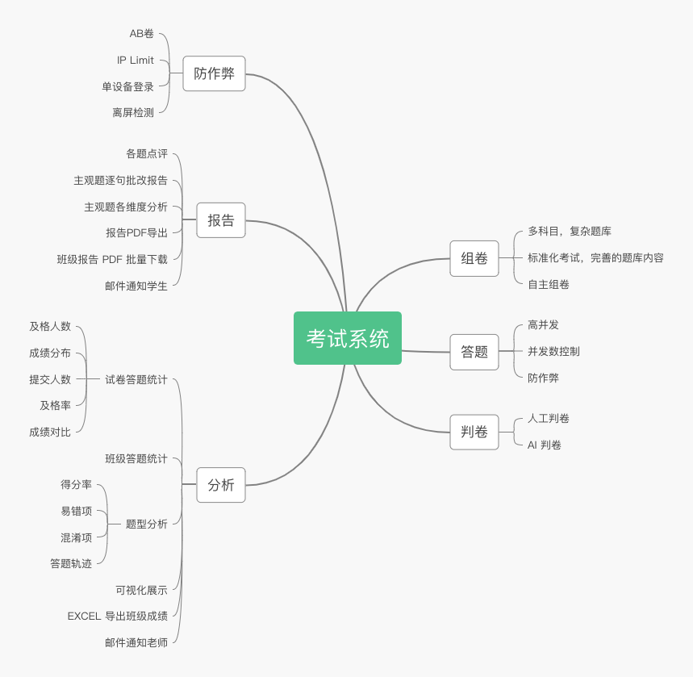
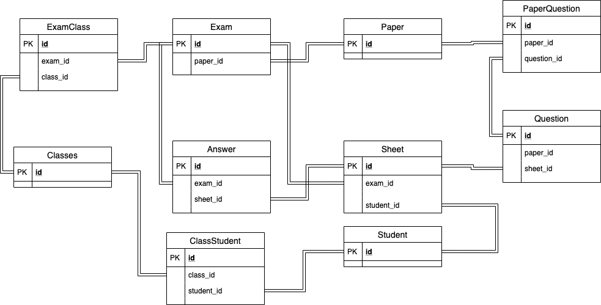
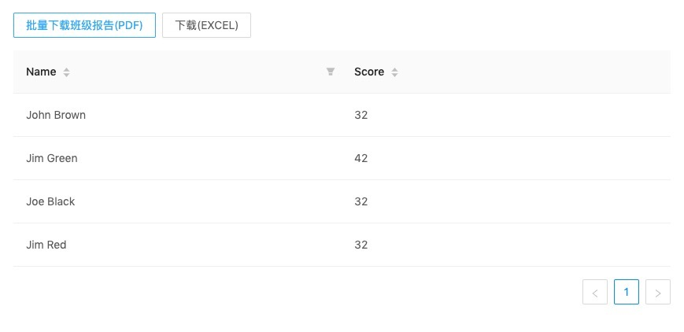
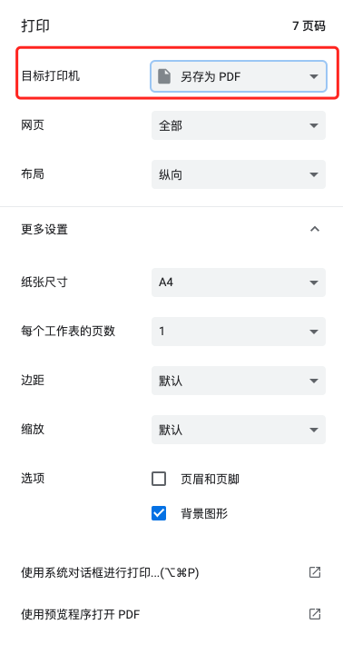

date: 2020-06-21 19:32

---

# 在线教育中技术与业务疑难问题之考试系统


---

[ toc ]

我在一家在线教育公司有一两年的时间，精力都投入到了考试系统的设计上。

对于考试系统这个产品，无论从各方面来讲，都有一些小小的收获。于是抽时间回顾并写了下来，希望对后来人有所裨益。由于我司偏英语教育，因此试举例时也偏向英语教育

> 东坡云："事如春梦了无痕"，苟不记之笔墨，未免有辜彼苍之厚。

## 概述

### 导图



### 考试系统在主系统中的位置


### 业务技术难点梳理


### 技术架构


## 线上考试的业务价值及中学高校信息化建设

我中学时代班级教室里刚进了一台电脑，投影仪及大屏幕，黑板教学转化为更丰富的多媒体的 PPT 教学。

考试系统的业务价值在与对教育的升级及补充，如同我十年前的班级中的电脑与投影仪。线上考试大大降低了线下考试的繁琐及复杂，并减轻了老师的负担。

而在国家政策中，《教育信息化“十三五”规划》再次强调，“要加强信息化专业队伍建设，确保各级各类学校信息化管理与服务工作得到落实”，因此一些高些也能因此受到国家拨款。

信息化建设主要体现在管理，教学上。在管理上有很多网络厂商及硬件厂商入驻，而在教学上，软件公司可以分一杯羹，在线考试属于教学的一部分，这也是服从于国家政策，服从于高校及中学的信息化建设。

## 目标用户：toB (or toC)

考试系统这一产品形态便注定它的场景大部分在 toB (business) 场景。

从上一部分的业务价值分析到它的场景大都在于学校，服务于学校的信息化建设。

那是不是也可以作用于更多的，非院校，弱组织重个人的考试，如成人自考，考研(可卖给培训机构)，四六级，计算机二级考试等。

换一句话说，是否可以把考试添加一种新的类型称之为模考，可从严格的定时定点并推广给广大的 C 端用户？但随之而来的新的挑战是：

1. 技术。更多的考试类型在技术上需要适配更通用的题库
1. 教研。更多的考试类型，可能需要额外的科目教研老师。但一般来讲，在线教育公司是重科目划分的 (或者重年龄单划分)
1. 运营及转化。C 端往往需要有运营来拉新留存转化，那转化的目标在哪里？在线教育公司转化一般指拉人培训，而非收会员。
1. 客单价。C 端的客单价实在是不值钱...

## 考试

考试，几乎所有人都经过中考高考的洗礼，所有人对它都非常熟悉，甚至痛恨与恐惧。

这一点很好，这是所有人都熟悉的业务，每个人都曾是该业务的用户，每个人都能对业务此添上一嘴，并很有可能提出****的建设性意见。

先来说一说考试的特点

1. 次数少。每年两次考试，因此我们作为开发来讲，一般大忙都在期末
1. 科目多。中学有语数外理化生政史地九门，大学有高数英语及各种专业课考试，题型及科目的多样性注定了它的题库复杂。科目多则体型杂，体型杂则数据结构化复杂，填空、单选、多选等客观题需要给出，数学推断，英语作文，英语口语及翻译。雅思多选与托佛多选的判分不一致
1. 标准化考试。标准化考试，就有标准题型，一致的判分准则。**标准化考试也需要相应的题库内容，比如历史四六级，历届高考**
1. 高并发。高并发没有绝对之分，只有相对而言。**当期末多个学校、院系统一考试几千人甚至几万人同时答题**，并且学生试卷答案实时提交，主观题几乎是有所改动就要提交一次，会对服务器造成过大的压力
1. 固定场地。线上会在机房进行统一考试，并且有监考老师巡场
1. 机房考试。可以使用最新的 Chrome，减少兼容性问题

关于这点，将在以下对他们的技术及业务层面展开讨论

## 考试系统，题库系统及大教学系统

考试系统及题库系统作为主教育系统的重要内容模块角色呈现，**教育系统是重内容及重服务的一个系统，而题库及考试系统更是构成它的重要组成部分**。

1. 教育系统为 toB 但可能服务不同方向的 SaaS 系统，为各个强内容模块的有机组合
2. 子系统指有完整前端、服务、及管理后台的系统。为教育系统的重要组成，可由路由直接跳转，也可由微前端或者 iframe 嵌入主系统中
3. 模块由业务模块组成，有可能代码集成在主教育系统也有可能由微服务统一提供

以下是各模块的联系：


## 考试的业务分析

关于考试的整场流程，可以分为以下五个大步骤

+ 组卷: 从题库组卷。设置题目，分数，答案，试题分析等
+ 考试: 根据试卷可以发布多次考试，考试可布置为多个院系班级。设置开考时间，考试时长，交卷时长限制，学生查成绩时间，迟到禁答时间，防作弊设置等
+ 防作弊: 防作弊的手段，一般包括 IP 限制，账号单设备限制，离屏检测，AB 卷四个方面，并支持防作弊检测失误的补偿方案
+ 判卷及报告: 客观题自动判卷，主观题 AI 判卷或人工判卷，判卷后可生成报告，可对班级报告进行 Excel 及 PDF 批量下载。
+ 分析: 对班级及试卷进行分析，如及格率，分数正态分布，题目错误率，试卷易错题，题目易错项，题目混淆项，答题轨迹等，并生成 Dashboard 进行可视化展示，并支持 PDF 及 EXCEL 下载

## 关于考试系统的表与关系

+ `Paper`: 试卷
+ `Exam`: 考试，一份试卷可以生成多次考试
+ `Classes`: 班级，一份考试可布置在多个班级当中，一个班级可以有多份考试
+ `Student`: 学生，一个班级有多个学生，一个学生也可在多个班级，一个学生对一份考试会生成一份答卷
+ `Sheet`: 答卷，某学生关于某考试的答题卡
+ `Question`: 问题，某一个试卷由多道题目组成，可能有多层嵌套。
+ `Answer`: 答题，答题卡上关于某问题的答案

以上就是关于考试系统的所有表及关系，这有助于梳理业务及对以下在真实场景中遇到的问题进行讲解，ER 图如下



## 科目分裂、题库及通用考试系统

正因为有多个科目，基于结构化的题库系统，**做一套通用的考试系统的本质是做一套通用的题库系统**

如对于数学而言

当然，更复杂的情形可参考我关于题库系统的文章

> 关于考试背后的题库系统，对于教育公司是相当重要的基础支撑服务，可参考我以前的文章分析

## 考试及其用户并发数限制的技术实现

**一些 toB 的产品一般拿机构用户数及用户并发数作为卖点**，机构用户数用一条 SQL 即可实现

而并发数限制可以用 `redis` 中 `zset` 实现，**不过个人感觉并发数限制是个 ROI 低并且费力不讨好的伪需求**

> 此时略有瑕疵，使用 userId 作为标志，可以考虑使用用户端传过来的 `fingerprint`

``` js
// 当一个用户访问接口时
await redis.zadd(`Organization:${organizationId}:concurrent`, Date.now(), `User:${userId}`)

// 查询当前机构的并发数
// 通过查询一分钟内的活跃用户来确认并发数
const count = await redis.zrangebyscore(`Organization:${organizationId}:concurrent`, Date.now() - 1000 * 60, Date.now())
```

## 防作弊，技术、业务与用户(学生)的折中

从中学到大学，每次考试总会听说有几个考试作弊的，对于考试作弊的手段也屡见不鲜。

但是线上的作弊手段比线下更繁杂，更新颖以及更容易。以下是我在做考试系统时经常能够看到的场景

1. 学生百度答案
1. 场外学生替考
1. 学生互传答案

**但是增加技术或业务的复杂性的同时，也会带来更多的问题** ，考试系统的防作弊有时会带来一些副作用

### 避免百度：离屏检测

对于离屏检测的设置可以总结为两个方面，次数及时间

+ 离屏五次
+ 并且累计丽萍时间超过三分钟

满足以上条件则判为作弊

### 离屏检测前端技术实现

在伟大的开放的浏览器环境下，可以通过浏览器事件 `visibilitychange` 及 `hide/show` 来监听离屏事件

但是它有一个致命的问题，悬浮框！当你开两个浏览器，一边做题，一边百度，这是无法被检测到的，那怎么办？

**全屏**

关于全屏也有一个浏览器的 API 及事件: `FullScreen API`，虽然 API 兼容性不太好，但是对于机房环境也是足够了的。

如此之来便没有问题了吗？如果你使用浏览器插件或者特殊浏览有小悬浮框的话，依然会被误判为离屏，并在线上前线老师反馈过几次问题。因此需要

1. 统一的考试环境
1. 卸掉不必要的插件

总结下离屏检测的技术实现

1. `FullScreen API` 全屏答卷
1. `visibilitychange` 离屏检测
1. 强统一的考试环境，避免各种插件的悬浮框

### 避免替考：IP 限制

如果对某场考试屏蔽了考场外 IP 地址，则场外替考变成了不可能

此时只需要写一个关于白名单的中间件就可以解决问题，伪代码如下

``` js
app.get('/exams/:id', IPWhiteListMiddle({ rule: ['XXX.XXX.XXX.XXX'] }))
```

这其中涉及到两个问题

### 如何获取客户端 IP

在 `koa` 及 `express` 中均有 api 可直接获取 IP，这里仅稍微介绍下原理

如果有 x-forwarded-for 的请求头，则取其中的第一个 IP，否则取建立连接 socket 的 remoteAddr。

而 x-forwarded-for 基本已成为了基于 proxy 的标准HTTP头，格式如下，可见第一个 IP 代表其真实的 IP

``` bash
X-Forwarded-For: 203.0.113.195, 70.41.3.18, 150.172.238.178
X-Forwarded-For: <client>, <proxy1>, <proxy2>
```

[在服务端应用中如何获得客户端 IP](https://github.com/shfshanyue/Daily-Question/issues/288)

### 支持 IP CIDR

[ip](https://www.npmjs.com/package/ip) 这个库支持 IP 的多种格式，周下载量几百万，并且无任何依赖，可放心使用

``` js
ip.cidrSubnet('192.168.1.134/26').contains('192.168.1.190') // true
```

### 避免替考：单设备

为了避免学生考试替考，当考生在场外有人替答时，在考场本人的电脑上显示整屏并且醒目的提示语，使得老师巡考时就能够发现该学生作弊。

1. 创建学生答题卡时，在 redis 中存入该答题卡对应的用户 token (答题卡是某学生针对某次考试的唯一记录)
1. 每次学生答题时，对比 token 是否一致

**当然 `token` 是可以共享的，严格意义上来说也有可能导致并非真正的单设备登录，此时可以替换为 `fingerprint`**

``` js
// 当创建学生答题卡时，存入该学生的 fingerprint
await redis.set(`Sheet:1285`, ctx.fingerprint)

// 每次提交答案时，对比此时的 fingerprint 与数据库中是否对应
const fingerprint = await redis.get(`Sheet:1285`)
if (ctx.fingerprint !== fingerprint) {

}
```

#### fingerprint

> 如何在浏览器获取唯一标识 `fingerprint` 呢？

越常见的需求就有越成熟的解决方案，在 github 中可以使用 [fingerprintjs2](https://github.com/fingerprintjs/fingerprintjs2) 来获取浏览器指纹信息，原理根据如下条件判断

1. UserAgent
1. WebGL
1. Canvas
1. 关于新型API的支持程度

### 避免传答案：AB卷

AB 卷并非指两套不同的卷子，而是指以下两方面的混淆，用以保证每个学生收到的考试卷子都是不一样的

1. 小题顺序混淆
1. 选择题选项顺序混淆

至于技术上的实现就相当简单了，在 `lodash` 中只需要一行代码

``` js
_.shuffle([1, 2, 3, 4]);
```

### 反作弊：补偿措施

当机器发现学生作弊时，弹出不可作答的界面，如果监考老师发现可以继续作答时

可在教师端进行操作解除限制

1. 清空离屏次数
1. 清空离屏时间
1. 清空单设备 Fingerprint/Token

## 答题优化：拍照答题

题目分为客观题及主观题，对于主观题来说，特别是数学类主观题来说线上答题特别复杂，如果能在纸上写再传到答题卡中就很方便

1. 数学等不好线上答题题型
1. 人工判卷给分

## 补考: 考试故障的兜底方案

如果考试过程中，某学生因设备问题或技术问题导致答案未提交到服务器怎么办？

让他与未及格学生一起去补考！

看，真正有效的办法总是这么简单粗暴并且充满着暴力美学。

## 自动改卷及人工改卷

### 自动改卷：AI，自研或第三方服务?

在线考试利在教师减压，一般而言客观题判分几乎不需要由老师参与，而主观题也可以通过 AI 来解放教师的生产力。在英语这门科目上，以下两种类型是需要并且能够做到人工判卷

+ 英语作文
+ 英语口语

自从几年前，SaaS 系统如雨后春笋成长起来，对于一些实力不够雄厚的小企业而言，直接购买服务相比自研是非常节省财力的一种方法。

而 AI 判卷自研，需要的成本也很高

1. 人力成本高，招人不好找
1. 机器成本高

如果非大企业，一般建议直接购买三方服务，而购买三方服务的优势也很明显

1. 成本低，相比养人与养机器而言，成本要低很多
1. 按需付费，按接口调用次数收费
1. 无需运维，所能提供的并发量也比自研大很多 (不过还是要往消息队列里扔一下)

## 考试分析: 班级分析与试卷分析

+ 易错项
+ 混淆项
+ 答题轨迹

## 考试报告分析与邮件通知

发送邮件，邮件服务即可。难点在于邮件的样式中

此时可以通过 `juice` 来注入样式

## 试卷及班级报告 EXCEL/PDF 批量生成

关于某一试卷及某一班级成绩的 EXCEL 信息生成及 PDF 批量下载。产品原型大致如下，一个关于班级成绩的大表哥以及两个关于下载的按钮



### EXCEL 生成

这是一个简单但是繁琐的需求，如果非要在技术上说一些可说的，那就是**在前端生成 excel 还是后端生成**

我是偏向于前端生成的，前后端分离，后端负责数据，前端负责 UI，而 excel 明显是属于 UI 一类的。而且在生产环境不止一次出现过 Excel 数据与页面列表数据不一致的问题，这就是 Excel 在后端生成的果。

关于 Excel 生成的 package，可以使用坐拥两万多颗星的 [sheetjs](https://github.com/SheetJS/sheetjs)

> 关于在生产环境的更多问题，可以参考山月总结的 [虫子集]()

### PDF 批量生成并打包下载的需求

在教师端的考试分析页面，一个班级，所有学生成绩，一张列表，一目了然，每个学生成绩都可以查看他们的本次考试报告

院方的教师看在眼里，想在心里：**如果可以把所有学生的报告都打包下载出来就好了**

### PDF 下载及样式

先不说 PDF 的批量下载，单说单个学生考试报告的下载

单个学生的下载可以直接通过 API 来完成，如下

``` js
window.print()
```

由于PDF下载与网页端有着分页的诸多不同，好在有媒体查询可以调整样式

``` css
@media print {

}
```

而分页也可以通过三个属性来控制，详细内容可以参考本篇文章 [page-break](https://css-tricks.com/almanac/properties/p/page-break/)

``` css
page-break-after  : auto | always | avoid | left | right
page-break-before : auto | always | avoid | left | right
page-break-inside : auto | avoid
```



对于这种方式利弊很明显，利在简单，弊在

1. 操作繁琐，需提供操作指南
1. 只能下载单个 PDF

### PDF 批量打包下载方案

那如何打包多个 PDF 批量下载呢，现在答案就很简单了，通过 `puppeteer`。来做一个 `urltopdf` 的服务。

当初，我在做这个服务的时候遇到了很多坑，包括

1. 容器中 chrome 依赖
1. 容器中 font 依赖

但是时代变了，随着 `serverless` 的发展，针对于无头浏览器已发展出了 `browserless`，对于 `urltopdf` 这类服务更是天然集成。

推荐以下技术方案，重运维，轻应用。很容易部署在 docker 及 k8s 集群中，另外你可以选择他们的 `SaaS` 方案，免于部署

[browserless](https://github.com/browserless/chrome)

当可以获取到所有 PDF 后，在通过 zip 压缩打包并下载，涉及到以下两个库

1. [jszip](https://github.com/Stuk/jszip): 负责打包所有的 pdf
1. [FileSaver.js](https://github.com/eligrey/FileSaver.js): 负责下载

### PDF批量下载时间：消息，限流及异步

我们要意识到的一点是 `urltopdf` 服务是一个高延迟低并发的服务，毕竟它跑在浏览器中，甚至几十个并发都有可能压垮服务器。

**限流。** 好在 `browserless/chrome` 天然支持配置限流，而免于在网关层配置。关于限流可参考我以前的文章 [限流及漏桶算法](https://shanyue.tech/post/rate-limit/)

设置20个并发限制

``` bash
docker run -e "MAX_QUEUE_LENGTH=10 MAX_CONCURRENT_SESSIONS=10" -p 3000:3000 --restart always -d --name browserless browserless/chrome
```

**消息队列及异步。** 在服务上游(生产侧)做好限流后，往往在服务发起端需要做好消息队列，用以控制访问上游服务的频率。方案如下

1. 班级成绩列表中批量下载 PDF 按钮置灰
1. 学生交卷并判卷成功后，扔到消息队列中
1. 生成 pdf 成功后入库
1. 该班级所有学生的 pdf 生成成功后，置灰取消 (可由 ws 通知)

关于消息队列的可选方案有以下几种

1. rocketmq
1. redis
1. kafka

好在 pdf 生成并入库满足幂等性，不会有太大的问题

## 多人考试中的并发

当学生在考场进行答题时，为了避免机房发生故障，因此学生试卷都需要实时提交答题卡，特别当在作文时，并发量会变得更大。这时，处理并发问题就会变得很重要

> 那如何看一个系统的 QPS 呢？

### 提前扩容及服务器升级、数据库升级

一般需要在接到大型考试之前通知运维同学，运维会临时购买阿里云服务器进行扩容 k8s 的 node，并扩展考试服务的 POD 数量

### 压测

``` bash
$ ab -c 100 -n 10000 https://exam-service/api/answers/submit
```

当然 `ab` 只能利用单核新能，如果要进行更复杂的压测，可以在阿里云使用压测服务

可以使用简单的命令进行压测，或者与运维共同压测，使用考试时1.5倍流量压测，用以找到一个更好的服务器 POD 扩容数量级限流大小

### 降级

关掉其它的不重要的接口，如

1. 降低考试时长心跳的发送频率
1. 关闭掉关于业务模块打点的请求

### 缓存

对于题库数据，可以缓存到 redis 甚至 CDN 中

### 异步及消息队列

1. 保存答案考虑落到消息队列并慢慢同步到数据库中。(复杂性提升，必要性不强，可往后考虑)
1. PDF 服务异步限流加消息队列
1. 自动判卷服务异步限流加消息队列

### 限流

对于以下两种高延迟的服务添加限流，并在调用方添加消息队列

1. PDF 服务异步限流加消息队列
1. 自动判卷服务异步限流加消息队列

### 熔断

## 与微信小程序的互补

考试系统中考试是以班级划分的，那如何更方便地加入班级呢？

可以在老师讲课之后放入班级二维码并通过扫码直接加入班级。另外小程序可以更好地与大教学系统结合

## 钉钉及文档类工具的冲击: Word 试卷

老师可以直接在钉钉上使用石墨文档布置试卷然后手工改卷。

## 与硬件进一步结合的思考

与硬件（平板捆绑销售）

## 总结

### 业务技术难点梳理


### 技术架构

