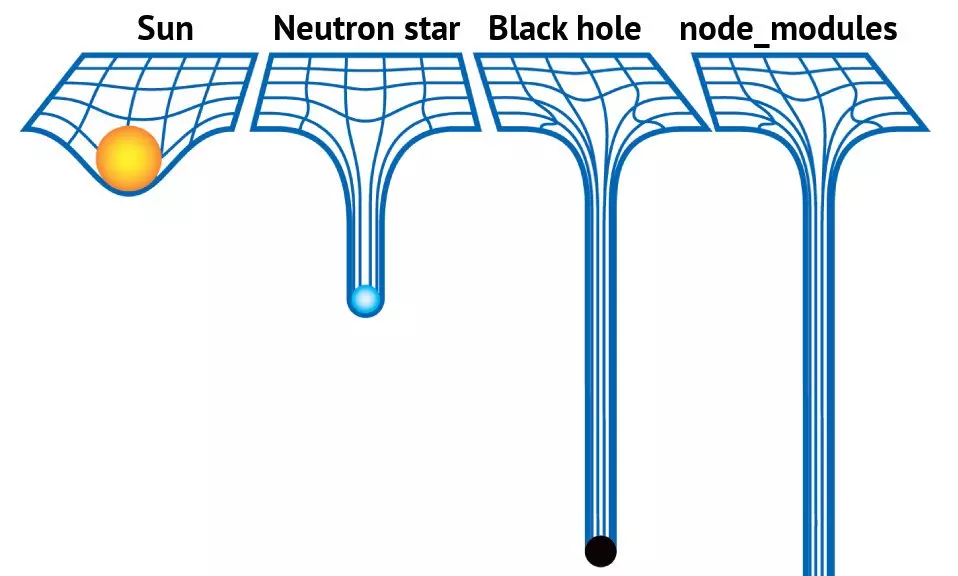

# 如何使用 docker 部署前端项目

Docker 变得越来越流行，它可以轻便灵活地隔离环境，进行扩容，运维管理。对于业务开发者而言，随着持续集成的发展，对代码质量及快速迭代的要求也越来越高。

对于前端而言，在 CI 环境中使用也更容易集成开发，测试与部署。比如可以为流水线(Pipeline)设置 Lint/Test/Security/Audit/Deploy/Artifact 等任务，更好地把控项目质量。

现在无论是前端，后端还是运维，都很强调 `devops` 的理念，接下来我将会写一系列关于 `devops` 在前端中应用的文章。你可以在我的博客 <https://github.com/shfshanyue/blog> 中或者我的公众号 【全栈成长之路】中订阅更多文章。

这里将介绍如何使用 Docker 部署前端应用，千里之行，始于足下。始于足下的意思就是，先让它能够跑起来。

## 先让它跑起来

首先，简单介绍一下一个典型的前端应用部署流程

1. `npm install`, 安装依赖
1. `npm run build`，编译，打包，生成静态资源
1. 服务化静态资源，如 nginx

介绍完部署流程后，简单写一个 Dockerfile

``` docker
FROM node:10-alpine

# 代表生产环境
ENV PROJECT_ENV production

# 许多 package 会根据此环境变量，做出不同的行为
# 另外，在 webpack 中打包也会根据此环境变量做出优化，但是 create-react-app 在打包时会写死该环境变量
ENV NODE_ENV production

WORKDIR /code
ADD . /code
RUN npm install && npm run build && npm install -g http-server
EXPOSE 80

CMD http-server ./public -p 80
```

现在这个前端服务已经跑起来了，接下来你可以完成部署的其它阶段了。

一般情况下，以下就成了运维的工作了，不过，拓展自己的知识边界总是没错的。其它阶段介绍如下

+ 使用 `nginx` 或者 `traefik` 做反向代理。在我内部集群中使用了 `traefik`，详见 [traefik 简易入门](https://github.com/shfshanyue/op-note/blob/master/traefik.md)
+ 使用 `kubernetes` 或者 `docker compose` 做容器编排。在我内部集群中使用了 `compose`，详见 [docker compose 简易入门](https://github.com/shfshanyue/op-note/blob/master/traefik-compose.md)
+ 使用 `gitlab ci`，`drone ci` 或者 `github actions` 等做 CI/CD 自动部署。在我内部集群中使用了 `github actions`，详见 [github actions 简易入门](https://github.com/shfshanyue/op-note/blob/master/github-action-guide.md)

这时镜像存在两个问题，导致每次部署时间过长，不利于产品的快速交付，没有快速交付，也就没有敏捷开发 (Agile)

+ 构建镜像时间过长
+ 构建镜像大小过大，多时甚至 1G+

## 利用镜像缓存

我们注意到，相对于项目的源文件来讲，`package.json` 是相对稳定的。如果没有新的安装包需要下载，则再次构建镜像时，无需重新构建依赖。则可以在 npm install 上节省一半的时间。

对于 `ADD` 来讲，如果需要添加的文件内容的 `checksum` 没有发生变化，则可以利用缓存。把 `package.json/package-lock.json` 与源文件分隔开写入镜像是一个很好的选择。目前，如果没有新的安装包更新的话，可以节省一半时间

``` dockerfile
FROM node:10-alpine

ENV PROJECT_ENV production
ENV NODE_ENV production

# http-server 不变动也可以利用缓存
RUN npm install -g http-server

WORKDIR /code

# 首次添加此两个文件，充分利用缓存
ADD package.json package-lock.json /code
RUN npm install --production

ADD . /code
RUN npm run build
EXPOSE 80

CMD http-server ./public -p 80
```

关于利用缓存有更多细节，需要特别注意一下。如 `RUN git clone <repo>`，如果命令字符串没有更新，则将使用缓存，当命令是非幂等性时，这将有可能导致问题。

> 关于缓存及可能导致的问题，可以参考我的文章 [Dockerfile 最佳实践](https://shanyue.tech/op/dockerfile-practice.html#%E5%85%85%E5%88%86%E5%88%A9%E7%94%A8%E6%9E%84%E5%BB%BA%E7%BC%93%E5%AD%98)

## CI 环境下的优化

``` dockerfile
FROM node:10-alpine

ENV PROJECT_ENV production
ENV NODE_ENV production

# http-server 不变动也可以利用缓存
RUN npm install -g http-server

WORKDIR /code

# 首次添加此两个文件，充分利用缓存
ADD package.json package-lock.json /code
RUN npm ci

ADD . /code
RUN npm run build
EXPOSE 80

CMD http-server ./public -p 80
```

在 CI 环境下主要做了一点改动：使用 `npm ci` 代替 `npm i`，经实验，`npm ci` 可以减少将近一半的的依赖安装时间。

``` bash
$ npm install
added 1154 packages in 60s

$ npm ci
added 1154 packages in 35s
```

另外，当 `package.json` 与 `package-lock.json` 版本不匹配时，`npm ci` 将会报出异常，提前检测出不安全信息，及早发现问题，及早解决问题。

关于安装依赖速度的优化，可以参考我以前的文章 [前端高级进阶：在生产环境中使你的 npm i 速度提升 50%](https://shanyue.tech/frontend-engineering/npm-install.html) 
   
## 多阶段构建

得益于缓存，现在镜像构建时间已经快了不少。但是，此时镜像的体积依旧过于庞大，这也将会导致部署时间的加长。原因如下

考虑下每次 CI/CD 部署的流程

1. 在构建服务器 (Runer) 构建镜像
1. 把镜像推至镜像仓库服务器
1. 在生产服务器拉取镜像，启动容器

显而易见，镜像体积过大会在前两步上传及下载时造成传输效率低下，增加每次部署的延时。

即使，构建服务器与生产服务器在同一节点下，没有延时的问题 (基本没可能)。减少镜像体积也能够节省磁盘空间。

关于镜像体积的过大，完全是因为node_modules 臭名昭著的体积:



但最后我们只需要构建生成的静态资源，对于源文件以及 `node_modules` 下文件，占用体积过大且不必要，造成浪费。

此时可以利用 Docker 的多阶段构建，仅来提取编译后文件，即打包生成的静态资源，对 Dockerfile 做一改进

``` docker
FROM node:10-alpine as builder

ENV PROJECT_ENV production
ENV NODE_ENV production

# http-server 不变动也可以利用缓存
WORKDIR /code

ADD package.json package-lock.json /code
RUN npm ci

ADD . /code
RUN npm run build

# 选择更小体积的基础镜像
FROM nginx:10-alpine
COPY --from=builder /code/public /usr/share/nginx/html
```

此时，镜像体积从 1G+ 变成了 50M+。若此时的部署仅仅是在测试环境或者多分支环境下为了方便测试，那就大功告成，完美解决问题了。

## 使用对象存储服务 (OSS)

分析一下 50M+ 的镜像体积，`nginx:10-alpine` 的镜像是16M，剩下的40M是静态资源。生产环境的静态资源往往会在独立域名上维护，并使用 CDN 进行加速。

**如果把静态资源给上传到文件存储服务，即OSS，并使用 CDN 对 OSS 进行加速，则没有必要打入镜像了。而在生产环境下也有对静态资源上 CDN 的强烈需求。**

此时镜像大小会控制在 20M 以下。虽然极大地减小了镜像体积，但是它会增加复杂度与增加镜像构建时间(如上传到OSS)，对于测试环境或者分支环境没必要使用 OSS。

关于静态资源，可以分类成两部分：

+ `/build`，此类文件在项目中使用 require/import 引用，会被 webpack 打包并加 hash 值，并通过 publicPath 修改资源地址。可以把此类文件上传至 oss，并加上永久缓存，不需要打入镜像
+ `/static`，此类文件在项目中直接引用根路径，直接打入镜像，如果上传至 OSS 可能增加复杂度 (批量修改 publicPath)

此时通过一个脚本命令 `npm run uploadOss`，来把静态资源上传至 OSS。更新后的 Dockerfile 如下

``` dockerfile
FROM node:10-alpine as builder

ENV PROJECT_ENV production
ENV NODE_ENV production

# http-server 不变动也可以利用缓存
WORKDIR /code

ADD package.json package-lock.json /code
RUN npm ci

ADD . /code

# npm run uploadOss 是把静态资源上传至 oss 上的脚本文件
RUN npm run build && npm run uploadOss

# 选择更小体积的基础镜像
FROM nginx:10-alpine
COPY --from=builder code/public/index.html code/public/favicon.ico /usr/share/nginx/html/
COPY --from=builder code/public/static /usr/share/nginx/html/static
```

## 小结

经过本篇文章总结，在前端中构建镜像需要注意以下几点

1. 镜像中使用基于 `alpine` 的镜像，减小镜像体积。
1. 镜像中需要锁定 `node` 的版本号，尽可能也锁定 `alpine` 的版本号，如 `node:10.19-alpine3.11`。(我示例代码中未如此详细地指出)
1. 选择合适的环境变量 `NODE_ENV` 及 `PROJECT_ENV`，如在测试环境下进行构建
1. npm ci 替代 npm i，避免版本问题及提高依赖安装速度
1. package.json 单独添加，充分利用镜像缓存
1. 使用多阶段构建，减小镜像体积
1. 如有必要，静态资源请上 CDN
