date: 2020-10-17 21:54
title: 敦煌游记
loc: 酒泉肃州区
spend: 8

--- 

# 敦煌

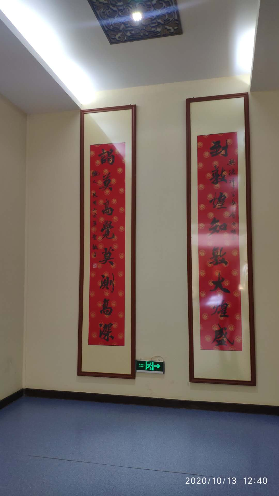

**到敦煌知毅大煌盛，谒莫高觉莫测高深**，这是敦煌博物馆中题的一副对联。

## 列四郡，据两关

敦煌，甘肃中一个偏远荒漠之地，并拥有着莫高窟这个人类宝库，这是我对敦煌的最初很模糊的印象。至于它是一个县城还是一个地级市抑或什么都不是，它又在甘肃的什么位置，这些都全然不知。

我对敦煌的认知渐渐有了轮廓，是在观看了央视纪录片《河西走廊》之后。《河西走廊》，真实一部值得看很多遍的神级纪录片。我也未曾想到我心中最佳纪录片竟是一部历史纪录片，毕竟潜意识中的历史纪录片是枯燥而乏味的。

敦煌，盛大辉煌之意，河西走廊的北部要塞，是汉武帝从河西走廊赶走匈奴后始置的*河西四郡*之一，*这也是河西四郡第一次纳入中原版图*。河西走廊，是通往西域的狭长地带形似走廊，又地处黄河以西，故名河西走廊。河西走廊上不仅拥有这风景秀丽的自然地理景观，更有历史悠久文化深厚的人文历史景观，并具有极高的战略价值。

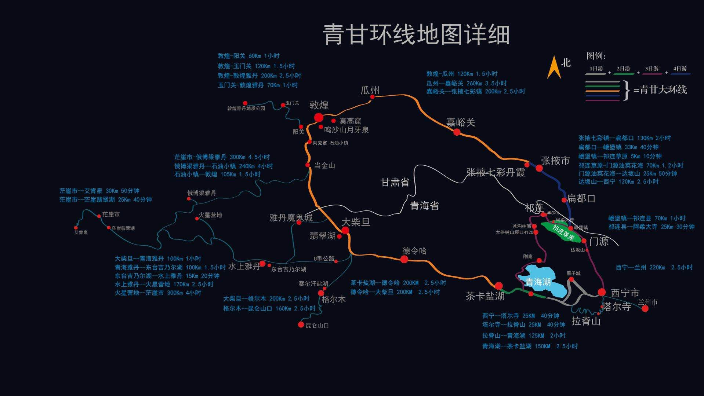

而河西廊上的河西四郡之名无不闪耀着汉武帝的武功，由北向南依次为：

+ 敦煌，盛大辉煌
+ 酒泉，城下有泉，泉水若酒
+ 张掖，断匈奴之臂，张汉室之臂掖
+ 武威，武功君威

> 渭城朝雨浥轻尘，客舍青青柳色新。
> 劝君更尽一杯酒，西出阳关无故人。

> 黄河远上白云间，一片孤城万仞山。
> 羌笛何须怨杨柳，春风不度玉门关。

*春风不度玉门关* 与 *西出阳关无故人* 想必大家耳熟能详，而玉门关与阳关就在敦煌，一南一北镇守着河西走廊，镇守着中原。

于是，我决定使用一周的时间与敦煌相遇。因为在这里，历史近在咫尺，无边戈壁的玉门关和人类宝库莫高窟吸引着自己。

## 到达敦煌

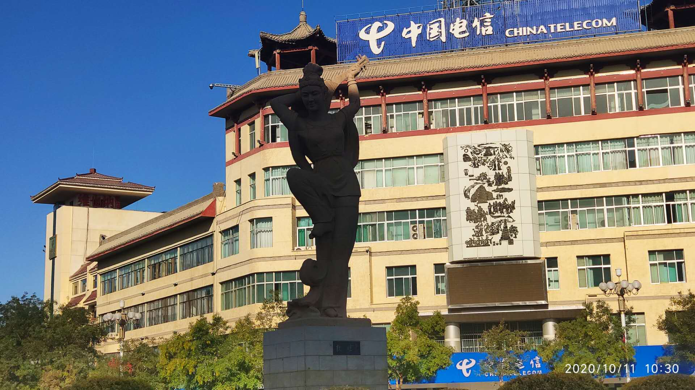

十月十号晚我从乌鲁木齐睡硬卧到柳园(瓜州)，再转大巴，到达了敦煌。新疆太大了，甘肃也太大了，乌鲁木齐到敦煌的距离就是北京到南京的距离。

九月二十九号，我已经到达了嘉峪关，也就是明万里长城西部的第一关，此时距离敦煌只有一步之遥。料想到国庆后敦煌的游人太多，为了更好的旅游体验，*为了充分利用我裸辞的优势*，也为了给我充足的时间补充敦煌的历史，于是我决定跳过敦煌直进哈密，国庆后再游敦煌。

这真是一个机智的决定，我真是一个天才啊！旅游体验何止增加了一倍：

1. 国庆敦煌的党河江景酒店一千一晚，而现在只需要一百五
1. 国庆莫高窟的洞窟挤半个小时才能进去，而现在随进随出

于是我住进了党河江景房，向本地人一样生活，一样去城区去菜市场瞎逛，来感受敦煌的脉动。由于窗户朝西，每天下午六点，阳光总是洒满了屋子

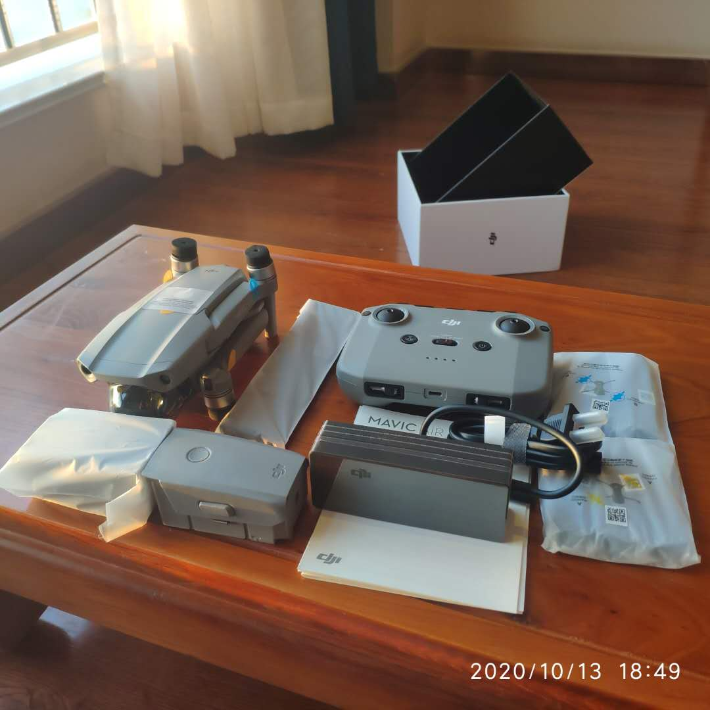

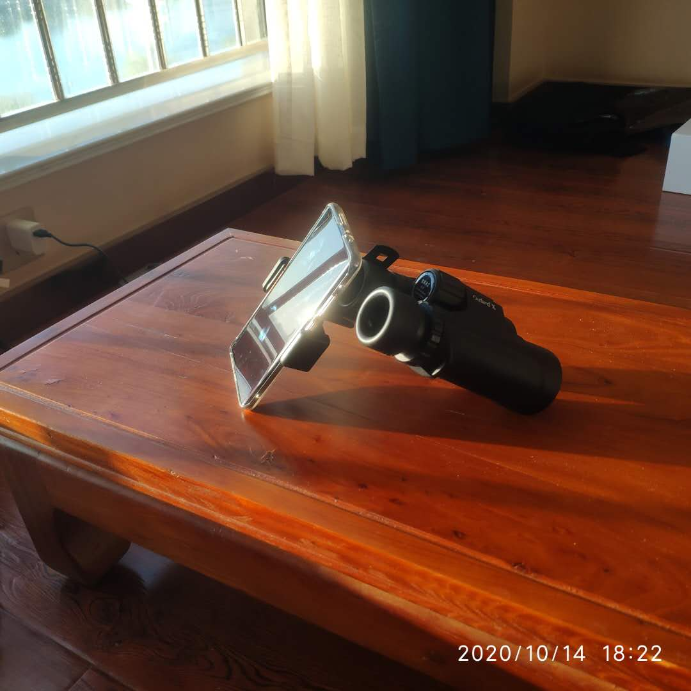

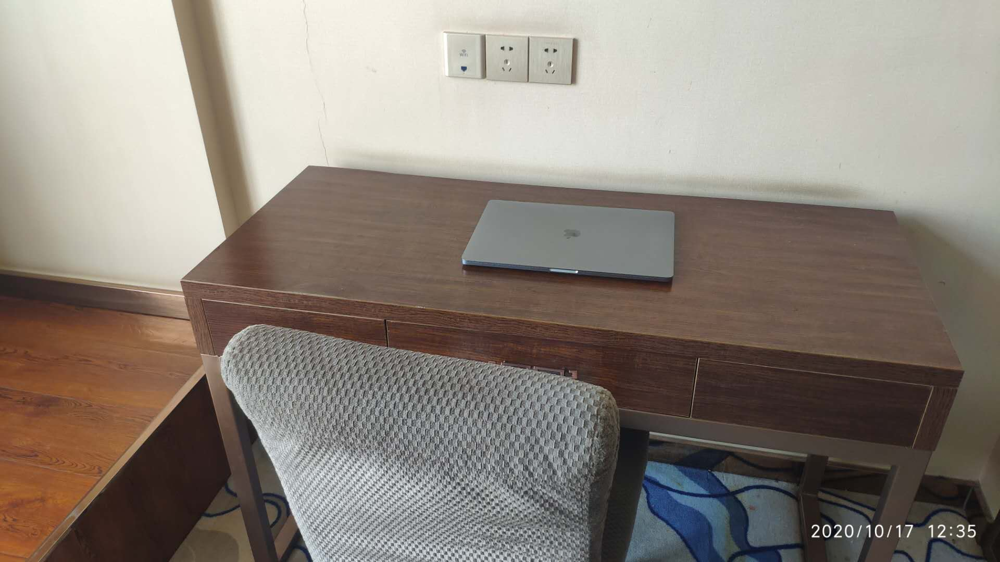

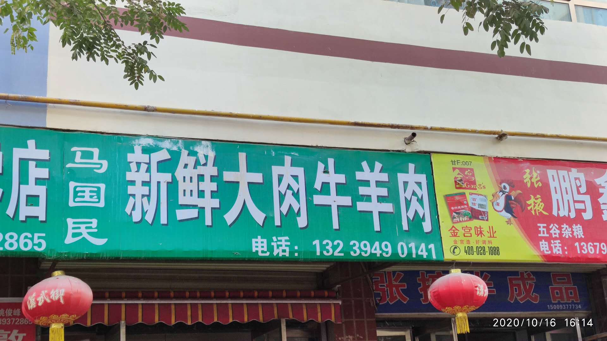

## 敦煌市

敦煌市，一个县级市，很小的一座城市，沙洲区是城区，用很短的时间就可以转完一圈。刚到了敦煌，我绕着它转了一圈，去亲身感受这座历史文化名城。从一座城市的街道命名中可以感受它历史的沧桑，比如西域路、阳关路、沙州路和祁连路。从密集的酒店聚集地可以看出它是一座旅游型城市。

敦煌，汉唐时华戎交汇地，从今看，大约是衰败了。河西四郡中武威、张掖和酒泉如今依然是地级市，而敦煌已经沦落为附属于酒泉的一个小小县城。它的衰败大概是从明朝时开始吧：明嘉靖七年，将军冯胜设嘉峪关，从此敦煌被抛置关外。

莫高窟的衰落与尘封，也伴随着敦煌地位的衰落：敦煌在明朝成为塞外游牧之地，莫高窟的最后一窟开凿于元朝。于是现代敦煌成了一个隶属于酒泉的县级市。

## 吃在敦煌

有两样食物在敦煌最是有名，**胡羊焖饼**和**驴肉黄面**，大街小巷上一路走过去，每走十步总是能够看见这八个大字。刚从敦煌汽车站出来，就迫不及待去尝试这传说中的美食。吃完后，嗯，也还好吧，至少我个人觉得不至于太好吃。关于好不好吃这是一个很主观的问题，但是，这俩菜都特别容易凉，还没吃完了就已凉了一半了。

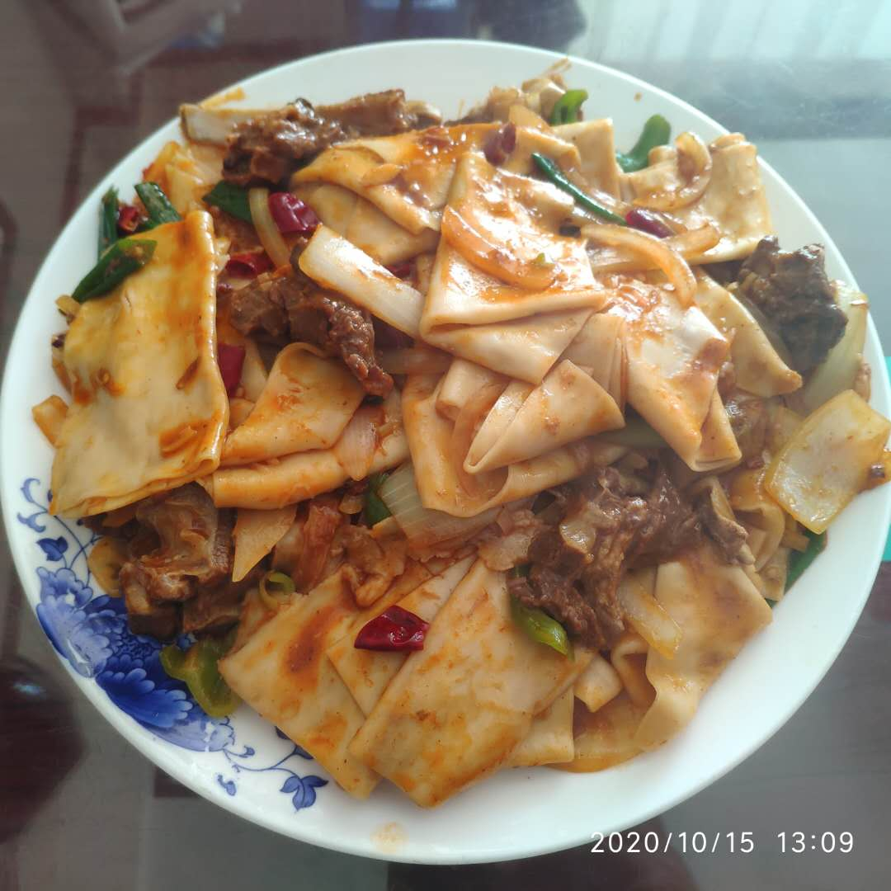

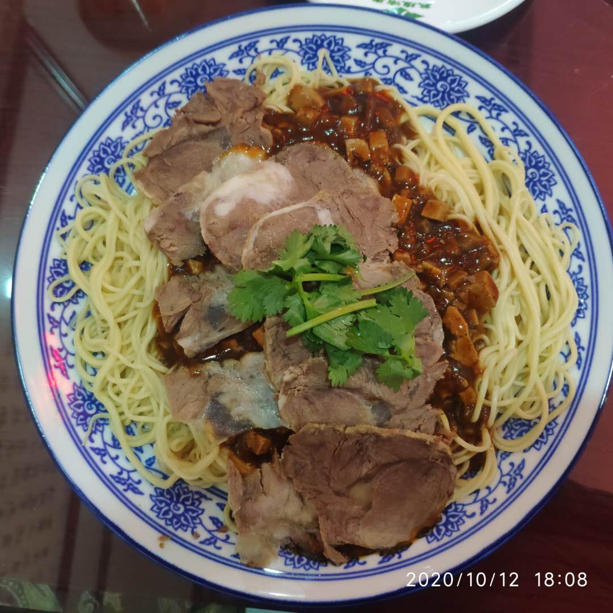

但是，大家也知道，单一样本意义不大，为了避免单一饭店给我带来认知上的偏差，来对这两种美食造成误解，那就罪过大了。于是我又吃了两三天的胡羊焖饼，不管是路边的苍蝇馆子，还是大众点评上的口味榜单。

**于是我明白了，驴不该这么犟。**

有一样饮品在敦煌最是有名，**李广杏皮茶**，李广杏是这里的特产，我还买了两斤扔在了宾馆来吃。在敦煌夜市中，一杯使用李广杏自制的杏皮茶十五块钱，这对于喜茶、CoCo来说相当便宜了，而对于每况愈下捉襟见肘身无分文的我来说还是很贵，这个时候我只能咬咬牙跺跺脚来尝一尝了。

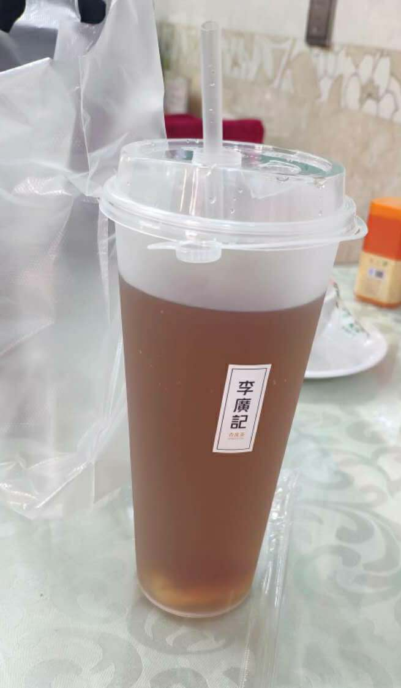

果然，贵的东西确实好喝。有一种淡淡的李广杏的味道，也有一种酸酸甜甜酸梅汤的味道。

还有一种油糕也很不错，整体呈现透明的球体: **泡儿油糕**

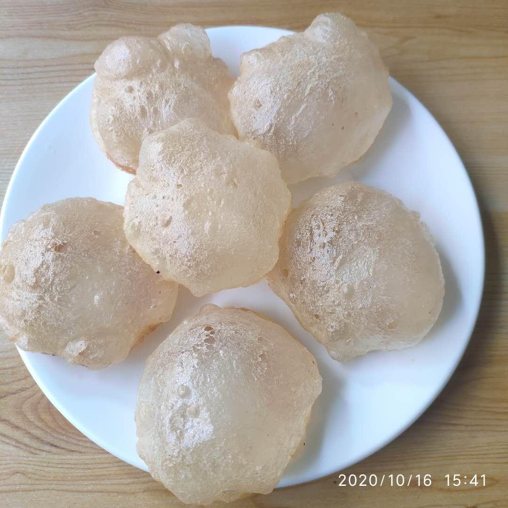

## 党河

**一江春水向东流**，中国的河流大多自西向东，而党河是中国唯一一条自北向南流向的河流，著名的月牙泉水的补给就来自党河地下水系。

党河是疏勒河的支流，而疏勒河是由祁连冰川形成的内流河，滋养着河西走廊，使这极干之地中形成了绿洲。**于是，你来到了敦煌，来到了甘肃，能够吃到当地特产，又鲜又嫩的小羊羔肉全是拜它所赐。**

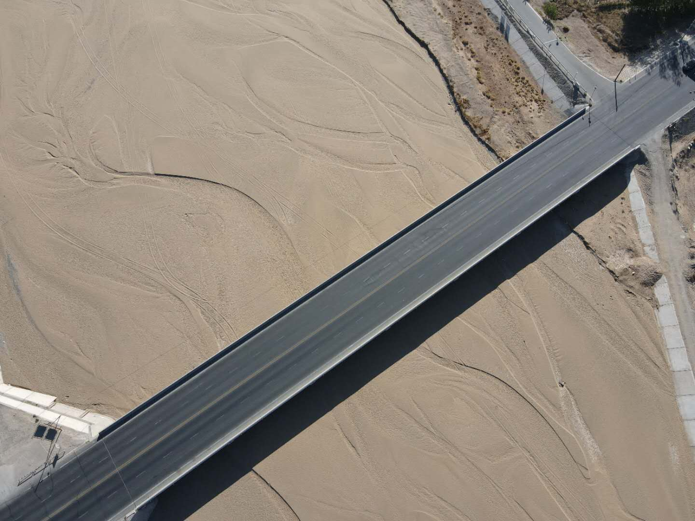

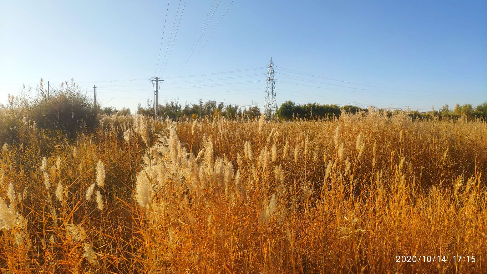

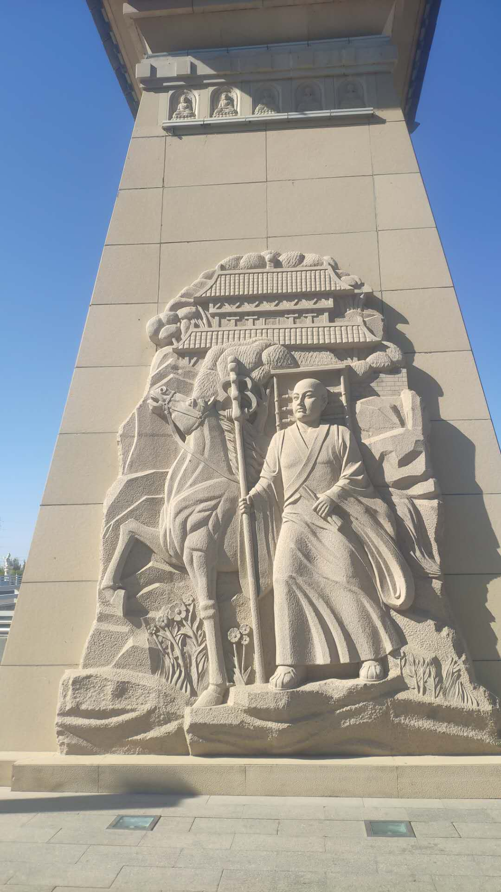

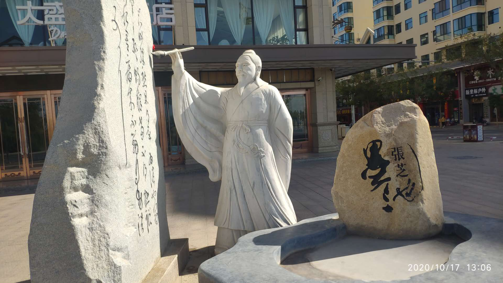

## 鸣沙山月牙泉

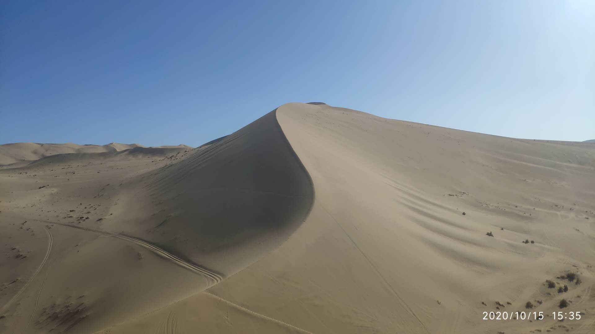

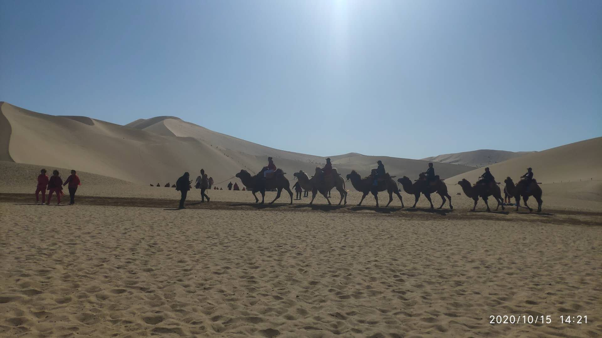

鸣沙山不是一座山，而是一类山的名字，风吹而沙响，所以叫鸣沙山。途径哈密时，巴里坤也有一座鸣沙山，一度以为是同一座山脉连绵不绝。如果运气不错，遇到风大，还能够听到响声，我运气足够好，只是遗憾没有录下来。

月牙泉就在鸣沙山中，距离城区五公里，公交与打车都很方便。月牙泉邻近月牙泉镇，只想去月牙泉的话，住在附近民宿，大漠露营也很方便。

鸣沙山月牙泉景区为国家 AAAAA 级景区，而里边的功劳大多因为是月牙泉，身处乱沙之中，却不被风沙所掩盖，被称为沙漠奇观。月牙之形千古如旧，恶境之地清流成泉，沙山之中不淹于沙，古潭老鱼食之不老。沙漠奇观是因为泉水在恶劣环境中的存在性这种自然奇观，如果你想去看月牙泉的别致景观，恐怕是要失望了。

所以，月牙泉的最大意义是爬上鸣沙山顶层，然后拍一张月牙泉的照片，并发朋友圈感叹一下沙漠之泉的自然奇迹。不然也对不起这一百一的大洋！！！

如果单从沙漠的角度来讲，更推荐鄯善的库木塔格沙漠，沙子更细更净更纯粹。

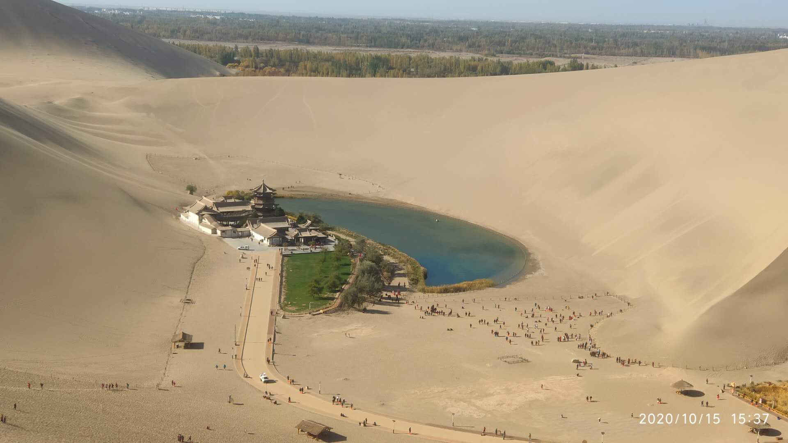

## 莫高窟

下次再说吧
