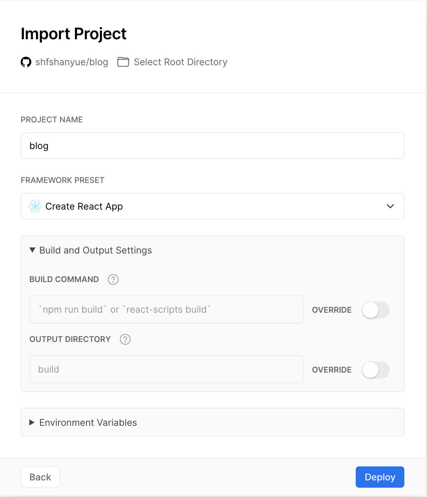

# 使用 Vercel 托管你的 API 服务

`Vercel`，官网 <https://vercel.com>，如同 `Netlify` 一般，可以提供免费的前端应用托管，甚至对开发者更加亲和与友好。

以下截图，可见一斑: **当你部署前端应用时，它能够根据你使用的技术栈而自动设置构建命令及输出目录**



`Vercel` 团队为了更好地推广他们的云服务，在开源中做了众多贡献，甚至盛名在外，以下几个 npm package 你即使没有使用过，但肯定会有所耳闻：

+ [next.js](https://github.com/vercel/next.js): 基于 React 的框架，也有可能是最好用的 SSR 方案
+ [swr](https://github.com/vercel/swr): 基于 React hooks 的数据请求库，可最大限度地充分利用缓存，并实现*乐观 UI*
+ [serve](https://github.com/vercel/serve): 适用于本地用于测试的静态文件托管服务

我们可以使用 `Vercel`/`Netlify`/`AliOSS` 以及各大云厂商的一些 Serverless 产品来几乎零成本地部署前端应用，但是偶尔也需要配套一些简单的 API 支持。如果购买一台云服务器，就是杀鸡焉用宰牛刀了。

你也可以选择各大云厂商的 Serverless 产品，但 `Vercel` 相对而言，学习成本低，更加容易上手，本篇文章介绍如何使用 `Vercel` 来部署 API 服务

## hello, world

新建 `/api/index.js`，文件内容如下，*标准的 HTTP Handler 的语法*，只要你熟悉 `http` 模块，就可以很快上手:

``` js
module.exports = (req, res) => {
  const { name = 'World' } = req.query
  res.send(`Hello ${name}!`)
}
```

虽然很简单，但是也有可能出错，以下是源码及演示地址:

+ 源码: <https://github.com/shfshanyue/vercel-api>
+ 演示地址: <https://vercel-api-orpin-omega.vercel.app/api>

以上是使用 `Node` 作为运行时的代码，但其实它还可以使用以下编程语言:

+ Node
+ Go
+ Python
+ Ruby

Runtime 拥有更多的 API 及配置，可见文档：

[Vercel Runtimes](https://vercel.com/docs/runtimes#official-runtimes/node-js)

## Rewrite 与 Redirect

部署完成后，默认的路由路径是 `/api`，此时 `/` 会*显示文件目录*，如果想更好地扩展路由呢？

通过配置文件 `vercel.json` 配置 `Rewrites/Redirects` 可完成此功能

``` json
{
  "rewrites": [
    {
      "source": "/",
      "destination": "/api"
    }
  ]
}
```

## 小而有创意的 API

由于 `Vercel` 这个 API 的本质也是 `Serverless`，最适合做一些轻量的若存储的服务。我也收集了一些小而有创意的服务，如下所列

+ [github-readme-stats](https://github.com/anuraghazra/github-readme-stats): Github Readme 的统计数据图表
+ [shields.io](https://github.com/badges/shields): 设计各种漂亮的 Badge
+ [qrcode api](http://goqr.me/api/): 生成二维码
+ [imageproxy](https://github.com/willnorris/imageproxy): 一个对图片进行处理的服务，也可以用来反防盗链
+ [avatar api](https://github.com/itsthatguy/avatars-api-middleware): 生成指定或随机的头像