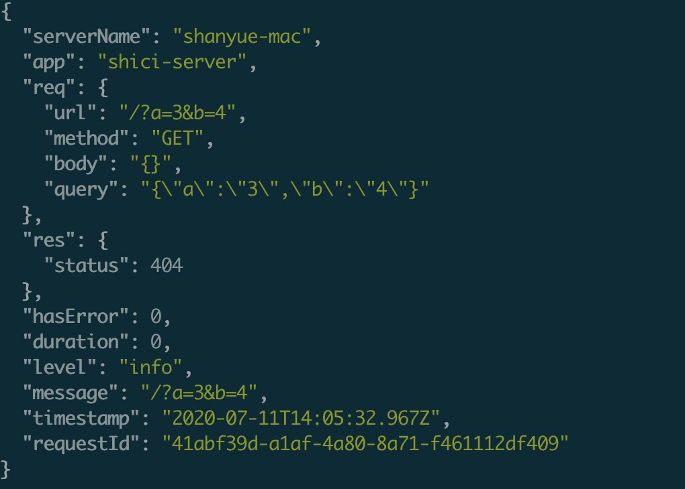
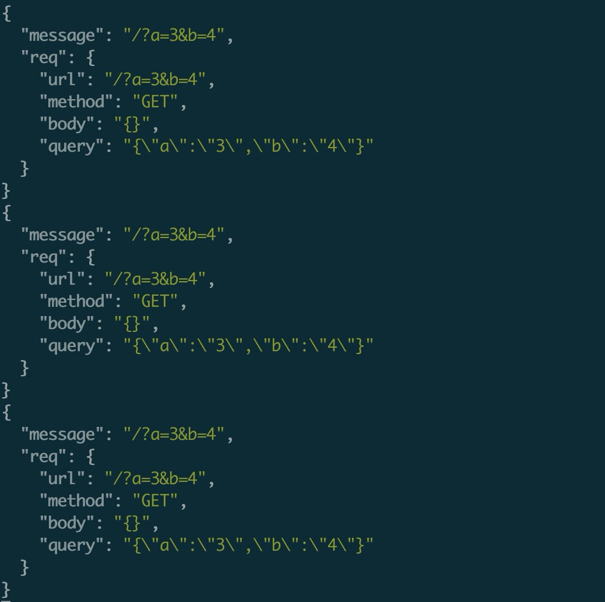

date: 2020-07-11 21:00

---

# Node 中如何更好地打日志

在服务器应用(后端项目)中，完善并结构化的日志不仅可以更好地帮助定位问题及复现，也能够发现性能问题的端倪，甚至能够帮忙用来解决线上 CPU 及内存爆掉的问题。

本篇文章将讲解如何使用 Node 在服务端更好地打日志

+ 哪里应该打日志: AccessLog、SQLLog、BusinessLog
+ 应该打什么日志: server_name、timestamp 以及相关类型日志
+ 用什么去打日志: winston、log4j、bunyan

产生日志后，将在下一章讲解日志的收集处理及检索

## 日志类型

在一个服务器应用中，或作为生产者，或作为消费者，需要与各方数据进行交互。除了最常见的与客户端交互外，还有数据库、缓存、消息队列、第三方服务。对于重要的数据交互需要打日志记录。

除了外界交互外，自身产生的异常信息、关键业务逻辑及定时任务信息，也需要打日志。

以下简述需要打日志的类型及涉及字段

+ `AccessLog`: 这是最常见的日志类型，一般在 `nginx` 等方向代理中也有日志记录，但在业务系统中有时需要更详细的日志记录，如 API 耗时，详细的 request body 与 response body
+ `SQLLog`: 关于数据库查询的日志，记录 SQL、涉及到的 table、以及执行时间，**从此可以筛选出执行过慢的SQL，也可以筛选出某条API对应的SQL条数**
+ `RequestLog`: 请求第三方服务产生的日志
+ `Exception`: 异常
+ `RedisLog`: 缓存，也有一些非缓存的操作如 `zset` 及分布式锁等
+ `Message Queue Log`: 记录生产消息及消费消息的日志
+ `CronLog`: 记录定时任务执行的时间以及是否成功
+ 关键业务逻辑

## 日志的基本字段

对于所有的日志，都会有一些共用的基本字段，如在那台服务器，在那个点产生的日志

### app

**即当前项目的命名**，在生产环境有可能多个项目的日志聚合在一起，通过 `app` 容易定位到当前项目

### serverName

**即服务器的 `hostname`**，通过它很容易定位到出问题的服务器/容器。

现已有相当多公司的生产环境应用使用 `kubernetes` 进行编排，而在 `k8s` 中每个 POD 的 `hostname` 如下所示，因此很容易定位到

1. `Deployment`: 哪一个应用/项目
1. `ReplicaSet`: 哪一次上线
1. `Pod`: 哪一个 Pod

``` bash
# shanyue-production 指 Deployment name
# 69d9884864 指某次升级时 ReplicaSet 对应的 hash
# vt22t 指某个 Pod 对应的 hash
$ hostname
shanyue-production-69d9884864-vt22t
```

### timestamp

**即该条日志产生的时间**，使用 `ISO 8601` 格式有更好的人可读性与机器可读性

``` json
{
  "timestamp": "2020-04-24T04:50:57.651Z",
}
```

### requestId/traceId

**及全链路式日志中的唯一id**，通过 `requestId`，可以把相关的微服务同一条日志链接起来、包括前端、后端、上游微服务、数据库及 redis

全链路式日志平台可以更好地分析一条请求在各个微服务的生命周期，目前流行的有以下几种，以下使他们的官网介绍

+ [zipkin](https://zipkin.io/): Zipkin is a distributed tracing system. It helps gather timing data needed to troubleshoot latency problems in service architectures. Features include both the collection and lookup of this data.
+ [jaeger](https://www.jaegertracing.io/): open source, end-to-end distributed tracing

### userId

**即用户信息**，当然有的服务可能没有用户信息，这个要视后端服务的性质而定。当用户未登录时，以 -1 替代，方便索引。

``` json
{
  "userId": 10086,
  // 当用户在未状态时，以 -1 替代
  "userId": -1,
}
```

## Node 中如何打日志: winston

[winston](https://github.com/winstonjs/winston) 是 Node 中最为流行的日志工具，支持各种各样的 `Transport`，能够让你定义各种存储位置及日志格式

当然还有其它可选的方案：如 []

``` js
{
  defaultMeta: {
    app: 'shici-service',
    serverName: os.hostname(),
    label
  }
}
```

``` js
import winston, { format } from 'winston'
import os from 'os'
import { session } from './session'

const requestId = format((info) => {
  // 关于 CLS 中的 requestId
  info.requestId = session.get('requestId')
  return info
})

function createLogger (label: string) {
  return winston.createLogger({
    defaultMeta: {
      serverName: os.hostname(),
      label
    },
    format: format.combine(
      // 打印时间戳
      format.timestamp(),
      // 打印 requestId
      requestId(),
      // 以 json 格式进行打印
      format.json()
    ),
    transports: [
      // 存储在文件中
      new winston.transports.File({
        dirname: './logs',
        filename: `${label}.log`,
      })
    ]
  })
}

const accessLogger = createLogger('access')
```

## 日志结构化

结构化的日志方便索引，而 JSON 是最容易被解析的格式，因此生产环境日志常被打印为 JSON 格式。

**那其它格式可以吗，可以，就是解析有点麻烦。当然 JSON 也有缺点，即数据冗余太多，会造成带宽的浪费。**

``` conf
http {
    include       mime.types;
    default_type  application/octet-stream;

    json_log_fields main 'remote_addr'
                         'remote_user'
                         'request'
                         'time_local'
                         'status'
                         'body_bytes_sent'
                         'http_user_agent'
                         'http_x_forwarded_for';
}
```

## npm scripts: 优化本地日志及筛选

在 `morgan` 中可以优化日志的可读性并打印在终端

``` js
morgan(':method :url :status :res[content-length] - :response-time ms')
```

而以上无论生产环境还是测试环境本地环境，都使用了 `json` 格式，并输出到了文件中，此时的可读性是不很差？

别急，这里用 `npm scripts` 处理一下，不仅有更好的可读性，而且更加灵活

``` json
{
  "log": "tail -f logs/api-$(date +'%Y-%m-%d').log | jq",
  "log:db": "tail -f logs/db-$(date +'%Y-%m-%d').log | jq"
}
```

通过命令行 `tail` 及 `jq`，做一个更棒的可视化。`jq` 是一款 `json` 处理的命令行工具，需提前下载

``` bash
$ brew install jq
```



因为打印日志是基于 `jq` 的，因此你也可以写 `jq script` 对日志进行筛选

``` bash
$ npm run log  '. | { message, req}' 
```



## 请求日志: AccessLog

**`AccessLog` 几乎是一个后端项目中最重要的日志**，在传统 Node 项目中常用 [morgan](https://github.com/expressjs/morgan)，但是它对机器读并不是很友好。

以下是基于 `koa` 的日志中间件:

1. 对于 Options、健康检查及一些不重要请求不打日志
1. 使用 `duration` 字段记录该响应的执行时间
1. 对于请求的 `body` 及 `query` 需要做序列化(stringify)处理，**避免在 `EliticSearch` 或一些日志平台中索引过多及错乱**
1. 记录全局的上下文信息，如 `User` 及一些业务相关联的数据

``` js
// 创建一个 access 的 log，并存储在 ./logs/access.log 中
const accessLogger = createLogger('access')

app.use(async (ctx, next) => {
  if (
    // 如果是 Options 及健康检查或不重要 API，则跳过日志
    ctx.req.method === 'OPTIONS' ||
    _.includes(['/healthCheck', '/otherApi'], ctx.req.url)
  ) {
    await next()
  } else {
    const now = Date.now()
    const msg = `${ctx.req.method} ${ctx.req.url}`
    await next()
    apiLogger.info(msg, {
      req: {
        ..._.pick(ctx.request, ['url', 'method', 'httpVersion', 'length']),
        // body/query 进行序列化，避免索引过多
        body: JSON.stringify(ctx.request.body),
        query: JSON.stringify(ctx.request.query)
      },
      res: _.pick(ctx.response, ['status']),

      // 用户信息
      userId: ctx.user.id || -1,

      // 一些重要的业务相关信息
      businessId: ctx.business.id || -1,
      duration: Date.now() - now
    })
  }
})
```

## 数据库日志: SQLLog

对于流行的服务器框架而言，操作数据库一般使用 ORM 操作，对于 Node，这里选择 `sequelize`

以下是基于 `sequelize` 的数据库日志及代码解释:

1. 绑定 CLS (Continues LocalStorage)，即可通过 `requestId` 查得每条 API 对应的查库次数，方便定位性能问题
1. 使用 `duration` 字段记录该查询的执行时间，可过滤 1s 以上数据库操作，方便发现性能问题
1. 使用 `tableNames` 字段记录该查询涉及的表，方便发现性能问题

``` js
// 创建一个 access 的 log，并存储在 ./logs/sql.log 中
const sqlLogger = createLogger('sql')

// 绑定 Continues LocalStorage
Sequelize.useCLS(session)

const sequelize = new Sequelize({
  ...options,
  benchmark: true,
  logging (msg, duration, context) {
    sqlLogger.info(msg, {
      // 记录涉及到的 table 与 type
      ...__.pick(context, ['tableNames', 'type']),
      // 记录SQL执行的时间
      duration
    })
  },
})
```

## Redis日志: RedisLog

`redis` 日志一般来说不是很重要，如果有必要也可以记录。

如果使用 `ioredis` 作为 redis 操作库，可侵入 `Redis.prototype.sendCommand` 来打印日志

``` js
import Redis from 'ioredis'
import { redisLogger } from './logger'

const redis = new Redis()

const { sendCommand } = Redis.prototype
Redis.prototype.sendCommand = async function (...options: any[]) {
  const response = await sendCommand.call(this, ...options);
  // 记录查询日志
  redisLogger.info(options[0].name, {
    ...options[0],
    // 关于结果，可考虑不打印，有时数据可能过大
    response
  })
  return response
}

export { redis }
```

## 总结

在一个后端项目中，以下类型需要打日志记录，本篇文章介绍了如何使用 Node 来做这些处理并附有代码

+ `AccessLog`: 这是最常见的日志类型，一般在 `nginx` 等方向代理中也有日志记录，但在业务系统中有时需要更详细的日志记录，如 API 耗时，详细的 request body 与 response body
+ `SQLLog`: 关于数据库查询的日志，记录 SQL、涉及到的 table、以及执行时间，**从此可以筛选出执行过慢的SQL，也可以筛选出某条API对应的SQL条数**
+ `RequestLog`: 请求第三方服务产生的日志
+ `Exception`: 异常
+ `RedisLog`: 缓存，也有一些非缓存的操作如 `zset` 及分布式锁等
+ `Message Queue Log`: 记录生产消息及消费消息的日志
+ `CronLog`: 记录定时任务执行的时间以及是否成功