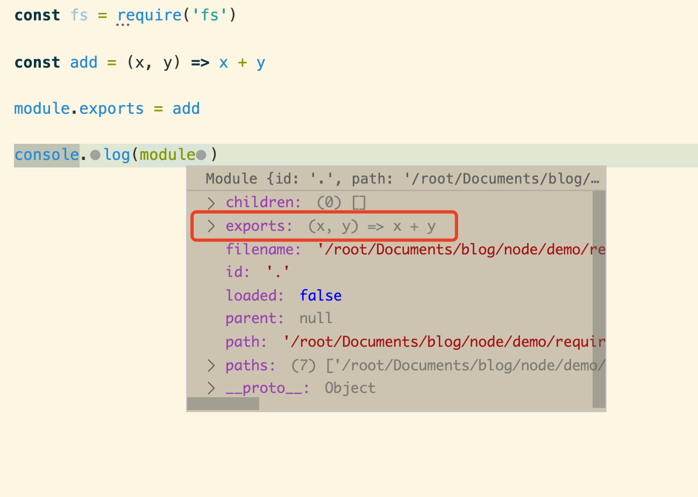
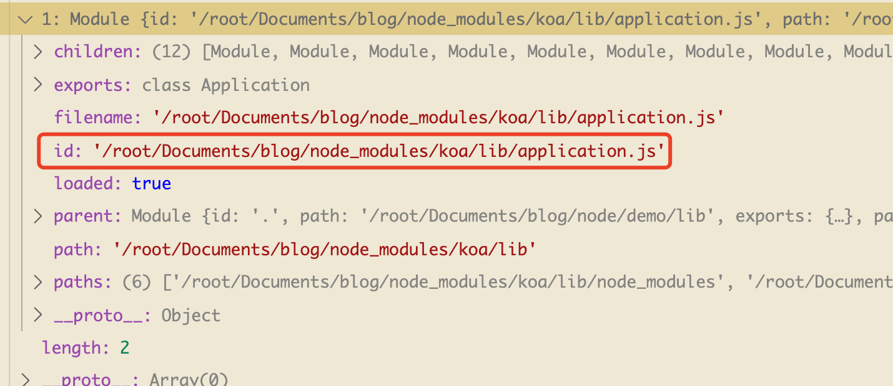
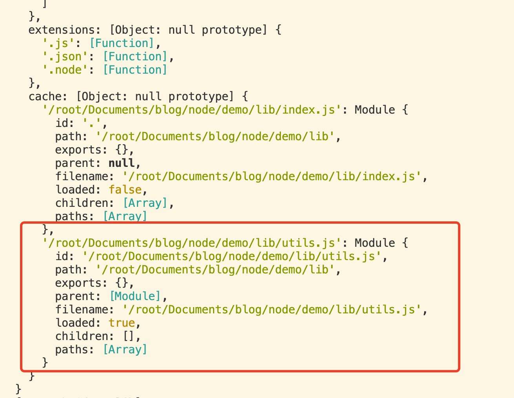

# Node 中如何引入一个模块及其细节

在 `node` 环境中，有两个内置的全局变量无需引入即可直接使用，并且无处不见，它们构成了 `nodejs` 的模块体系: `module` 与 `require`。以下是一个简单的示例

``` js
const fs = require('fs')

const add = (x, y) => x + y

module.exports = add
```

虽然它们在平常使用中仅仅是引入与导出模块，但稍稍深入，便可见乾坤之大。在业界可用它们做一些比较 trick 的事情，虽然我不大建议使用这些黑科技，但稍微了解还是很有必要。

1. 如何在不重启应用时热加载模块？如 `require` 一个 json 文件时会产生缓存，但是重写文件时如何 `watch`
1. 如何通过不侵入代码进行打印日志
1. 循环引用会产生什么问题？

## module wrapper

当我们使用 `node` 中写一个模块时，实际上该模块被一个函数包裹，如下所示:

``` js
(function(exports, require, module, __filename, __dirname) {
  // 所有的模块代码都被包裹在这个函数中
  const fs = require('fs')

  const add = (x, y) => x + y

  module.exports = add
});
```

因此在一个模块中自动会注入以下变量：

+ `exports`
+ `require`
+ `module`
+ `__filename`
+ `__dirname`

## module

调试最好的办法就是打印，我们想知道 `module` 是何方神圣，那就把它打印出来！

``` js
const fs = require('fs')

const add = (x, y) => x + y

module.exports = add

console.log(module)
```



+ `module.id`: 如果是 `.` 代表是入口模块，否则是模块所在的文件名，可见如下的 `koa`
+ `module.exports`: 模块的导出



## module.exports 与 exports

> [`module.exports` 与 `exports` 有什么关系？](https://github.com/shfshanyue/Daily-Question/issues/351)

从以下源码中可以看到 `module wrapper` 的调用方，因此很容易理解一个模块中的内置变量：

+ `exports`: 实际上是 `module.exports` 的引用
+ `require`: 大多情况下是 `Module.prototype.require`
+ `module`
+ `__filename`
+ `__dirname`: `path.dirname(__filename)`

``` js
// 
const dirname = path.dirname(filename);
const require = makeRequireFunction(this, redirects);
let result;

// 从中可以看出：exports = module.exports
const exports = this.exports;
const thisValue = exports;
const module = this;
if (requireDepth === 0) statCache = new Map();
if (inspectorWrapper) {
  result = inspectorWrapper(compiledWrapper, thisValue, exports,
                            require, module, filename, dirname);
} else {
  result = compiledWrapper.call(thisValue, exports, require, module,
                                filename, dirname);
}
```

## require

通过 `node` 的 REPL 控制台，或者在 `VSCode` 中输出 `require` 进行调试，可以发现 `require` 是一个极其复杂的对象


从以上 `module wrapper` 的源码中也可以看出 `require` 由 `makeRequireFunction` 函数生成，如下

``` js
// <node_internals>/internal/modules/cjs/helpers.js:33

function makeRequireFunction(mod, redirects) {
  const Module = mod.constructor;

  let require;
  if (redirects) {
    // ...
  } else {
    // require 实际上是 Module.prototype.require
    require = function require(path) {
      return mod.require(path);
    };
  }

  function resolve(request, options) { // ... }

  require.resolve = resolve;

  function paths(request) {
    validateString(request, 'request');
    return Module._resolveLookupPaths(request, mod);
  }

  resolve.paths = paths;

  require.main = process.mainModule;

  // Enable support to add extra extension types.
  require.extensions = Module._extensions;

  require.cache = Module._cache;

  return require;
}
```

> 关于 `require` 更详细的信息可以去参考官方文档: [Node API: require](https://nodejs.org/api/modules.html#modules_require_id)

## require(id)

`require` 函数被用作引入一个模块，也是平常最常见最常用到的函数

``` js
// <node_internals>/internal/modules/cjs/loader.js:1019

Module.prototype.require = function(id) {
  validateString(id, 'id');
  if (id === '') {
    throw new ERR_INVALID_ARG_VALUE('id', id,
                                    'must be a non-empty string');
  }
  requireDepth++;
  try {
    return Module._load(id, this, /* isMain */ false);
  } finally {
    requireDepth--;
  }
}
```

而 `require` 引入一个模块时，实际上通过 `Module._load` 载入，大致的总结如下：

1. 如果 `Module._cache` 命中模块缓存，则直接取出 `module.exports`，加载结束
1. 如果是 `NativeModule`，则 `loadNativeModule` 加载模块，如 `fs`、`http`、`path` 等模块，加载结束
1. 否则，使用 `Module.load` 加载模块，当然这个步骤也很长，下一章节再细讲

``` js
// <node_internals>/internal/modules/cjs/loader.js:879

Module._load = function(request, parent, isMain) {
  let relResolveCacheIdentifier;
  if (parent) {
    // ...
  }

  const filename = Module._resolveFilename(request, parent, isMain);

  const cachedModule = Module._cache[filename];

  // 如果命中缓存，直接取缓存
  if (cachedModule !== undefined) {
    updateChildren(parent, cachedModule, true);
    return cachedModule.exports;
  }

  // 如果是 NativeModule，加载它
  const mod = loadNativeModule(filename, request);
  if (mod && mod.canBeRequiredByUsers) return mod.exports;

  // Don't call updateChildren(), Module constructor already does.
  const module = new Module(filename, parent);

  if (isMain) {
    process.mainModule = module;
    module.id = '.';
  }

  Module._cache[filename] = module;
  if (parent !== undefined) { // ... }

  let threw = true;
  try {
    if (enableSourceMaps) {
      try {
        // 如果不是 NativeModule，加载它
        module.load(filename);
      } catch (err) {
        rekeySourceMap(Module._cache[filename], err);
        throw err; /* node-do-not-add-exception-line */
      }
    } else {
      module.load(filename);
    }
    threw = false;
  } finally {
    // ...
  }

  return module.exports;
};
```

## require.cache

**当代码执行 `require(lib)` 时，会执行 `lib` 模块中的内容，并作为一份缓存，下次引用时不再执行模块中内容**。

这里的缓存指的就是 `require.cache`，也就是上一段指的 `Module._cache`

``` js
// <node_internals>/internal/modules/cjs/loader.js:899

require.cache = Module._cache;
```

这里有个小测试:

> 有两个文件: `index.js` 与 `utils.js`。`utils.js` 中有一个打印操作，当 `index.js` 引用 `utils.js` 多次时，`utils.js` 中的打印操作会执行几次。代码示例如下

**index.js**

``` js
// index.js

// 此处引用两次
require('./utils')
require('./utils')
```

**utils.js**

``` js
// utils.js
console.log('被执行了一次')
```

**答案是只执行了一次**，因此 `require.cache`，在 `index.js` 末尾打印 `require`，此时会发现一个模块缓存

``` js
// index.js

require('./utils')
require('./utils')

console.log(require)
```



## 总结

