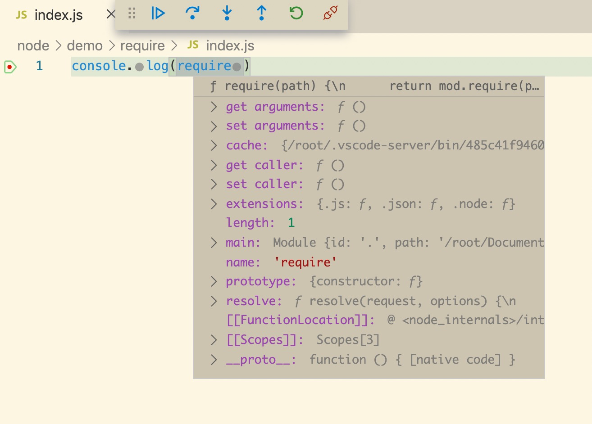

# Node 中如何引入一个模块及其细节

在 `node` 环境中，有两个内置的全局变量无需引入即可直接使用，并且无处不见，它们构成了 `nodejs` 的模块体系: `module` 与 `require`

``` js
const fs = require('fs')

const add = (x, y) = x + y

module.exports = add
```

虽然它们在平常使用中仅仅是引入与导出模块，但稍稍深入，便可见乾坤之大。在业界可用它们做一些比较 trick 的事情，虽然我不大建议使用这些黑科技，但稍微了解还是很有必要。除此之外，如果不够了解，也无法解决由此产生的 OOM 等诸多问题

1. 如何在不重启应用时热加载模块？如 `require` 一个 json 文件时会产生缓存，但是重写文件时如何 `watch`
1. 如何通过不侵入代码进行打印日志
1. 循环引用会产生什么问题？由此产生的 OOM 问题如何解决

## module

假设有两个文件 `index.js`

## module.exports 与 exports

## require

通过 `node` 的 REPL 控制台，或者在 `VSCode` 中输出 `require` 进行调试，可以发现 `require` 是一个极其复杂的对象



关于 `require` 更详细的信息可以去参考官方文档: [Node API: require](https://nodejs.org/api/modules.html#modules_require_id)

## require.cache

**当代码执行 `require(lib)` 时，会执行 `lib` 模块中的内容，并作为一份缓存，下次引用时不再执行模块中内容**。这里的缓存指的就是 `require.cache`

这里有个小测试:

> 有两个文件: `index.js` 与 `utils.js`。`utils.js` 中有一个打印操作，当 `index.js` 引用 `utils.js` 多次时，`utils.js` 中的打印操作会执行几次。代码示例如下

``` js
// index.js

// 此处引用两次
require('./utils')
require('./utils')
```

``` js
// utils.js
console.log('被执行了一次')
```

**答案是只执行了一次**，因此 `require.cache`，在 `index.js` 末尾打印 `require`，此时会发现一个 `id: Module` 格式的模块缓存

``` js
// index.js

require('./utils')
require('./utils')

console.log(require)
```

# 循环依赖：require cycles