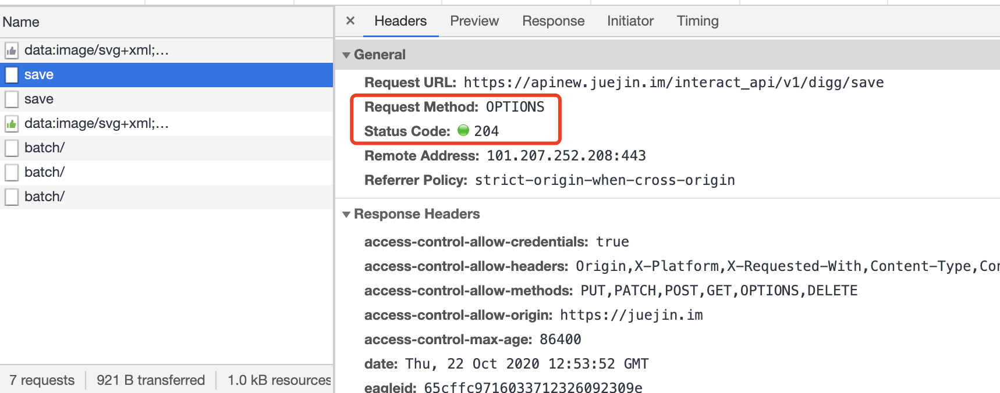
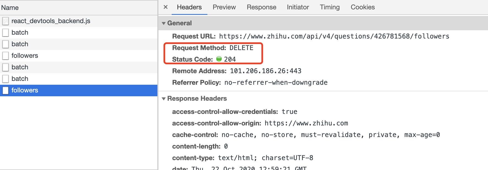
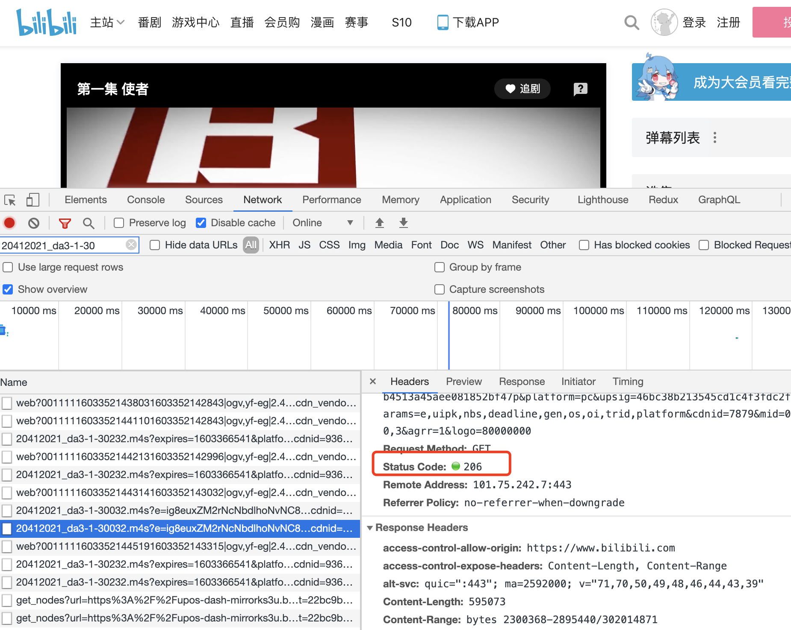
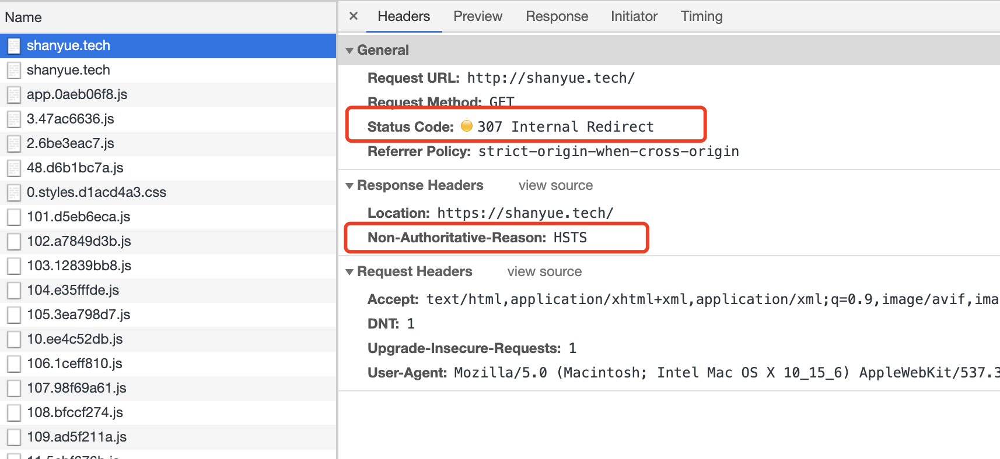
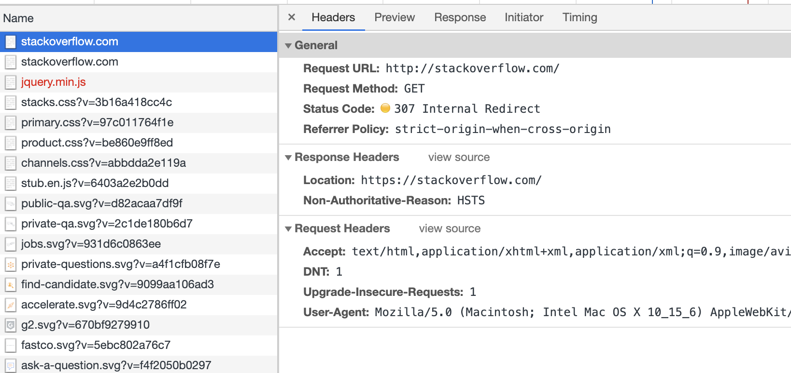
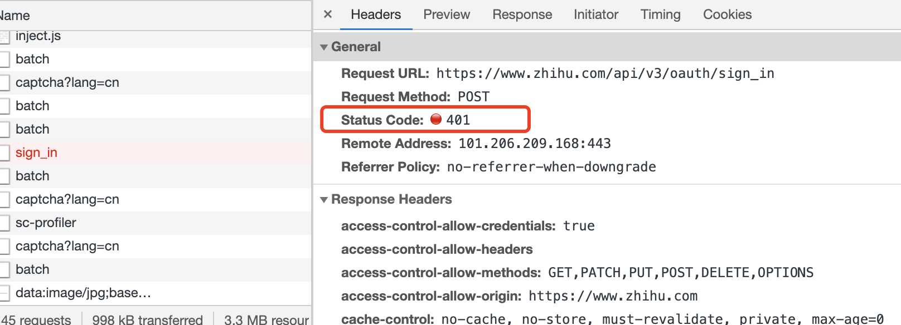
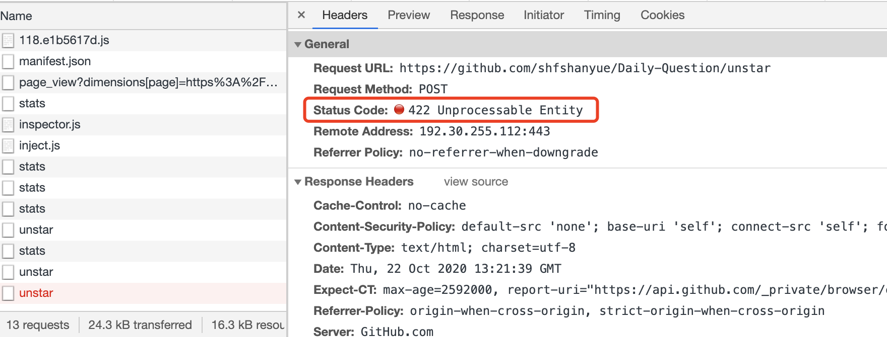

# HTTP 有哪些状态码

## 101 Switch Protocol

升级协议，如从 http 到 ws

示例:


## 200 Ok

表示资源请求成功

示例:

``` bash
$ curl https://shanyue.tech --head
HTTP/2 200
```

## 201 Created

资源创建成功，多用于 POST 请求

## 204 No Content

响应不会返回 Body，一般由以下两种情况

1. 与 Options/Delete 请求搭配
1. 打点类

示例一: 掘金为 Options 请求的状态码设置为 204



示例二: 知乎为 Delete 请求的状态码设置为 204，以下请求为取消关注



示例三: 当你在知乎看段子时，不妨打开控制台，会发现一个是 204 的状态码

``` bash
# 从命名上来看，大致是性能分析类请求
curl 'https://www.zhihu.com/sc-profiler' \
  -H 'content-type: application/json' \
  --data-binary '[["i","production.heifetz.main.desktop.v1.Collector.screen.1536_960.count",1,1]]' \
  --compressed -vvv
< HTTP/2 204
< server: CLOUD ELB 1.0.0
< date: Thu, 22 Oct 2020 07:46:30 GMT
< content-type: text/html
< vary: Accept-Encoding
< x-backend-response: 0.002
< cache-control: no-cache, no-store, must-revalidate, private, max-age=0
```

## 206 Partial Content

当请求多媒体数据数据较大时，会进行分片传输。当你在B站观看视频，打开开发者工具，会发现许多 206 状态码以及响应头 Content-Range

示例:



## 301 Moved Permanently

永久重定向。http 转向 https时，有时会使用 301，如 B 站。

``` bash
$ curl www.bilibili.com -vvv
< HTTP/1.1 301 Moved Permanently
< Server: Tengine
< Date: Thu, 22 Oct 2020 08:04:59 GMT
< Content-Type: text/html
< Content-Length: 239
< Connection: keep-alive
< Location: https://www.bilibili.com/
```

## 302 Found

暂时重定向。http 转向 https时，有时也会使用 302，如知乎

``` bash
$ curl www.zhihu.com -vvv
< HTTP/1.1 302 Found
< Location: https://www.zhihu.com/
< Content-Length: 0
< X-NWS-LOG-UUID: 16068764905156850032
< Connection: keep-alive
< Server: Lego Server
< Date: Thu, 22 Oct 2020 08:20:29 GMT
< X-Cache-Lookup: Return Directly
```

## 304 Not Modified

资源已被缓存，与之相关的响应头部有：

+ `ETag`
+ `last-modified`/`if-modified-since`

一般用作 `index.html` 等不带 hash 的资源，由于示例太多，这里就不举例了

## 307 Temporary Redirect

暂时重定向。也可作为 http 到 https 的重定向。还有一种用途用作 HSTS，当谷歌浏览器发现某 http 资源已被加入到 HSTS 列表，浏览器内部会通过 307 作重定向

示例:





## 400 Bad Request

可以用于做 API 的参数校验

## 401 Unauthorized

当没有权限的用户请求需要带有权限的资源时，会返回 401，此时携带正确的权限凭证再试一次可以解决问题



## 403 Forbidden

我就是不想让你访问，不管你的权限凭证是否正确！

> In summary, a 401 Unauthorized response should be used for missing or bad authentication, and a 403 Forbidden response should be used afterwards, when the user is authenticated but isn’t authorized to perform the requested operation on the given resource.

+ [403与401状态码有什么区别](https://stackoverflow.com/questions/3297048/403-forbidden-vs-401-unauthorized-http-responses)

## 404 Not Found

未找到资源

## 405 Method Not Allowed

我需要 POST 这条资源，你去 GET 个锤子

## 413 Payload Too Large

不要给我扔这么大的 Body，我处理不过来

## 418 I'm A Teapot

我是一个茶壶

我要抛咖啡，你却扔给我一个茶壶？

也可以用来处理不合法的参数校验，我想要个字符串，你给了我一个整数？

## 422 Unprocessable Entity

常用来处理不合法的参数校验。

Github 上给某个项目点赞时，故意设置一个不正确的参数命名，会返回状态码 422



## 500 Internal Server Error

服务器内部错误，很有可能是应用层未捕获错误而导致整个服务挂掉

## 502 Bad Gateway

网关超时，Nginx 上常见，从上游应用层返回了响应

## 503 Service Unavailable

由于大量流量造成服务忙，稍等一下说不定就能用了

## 504 Gateway Timeout

网关超时，上游应用层迟迟未响应