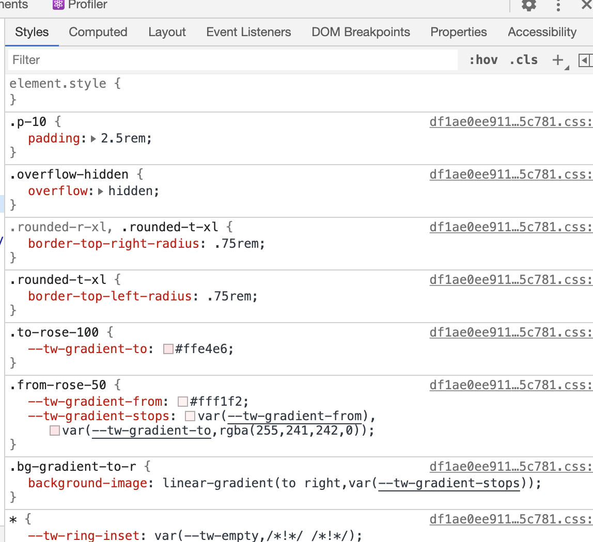
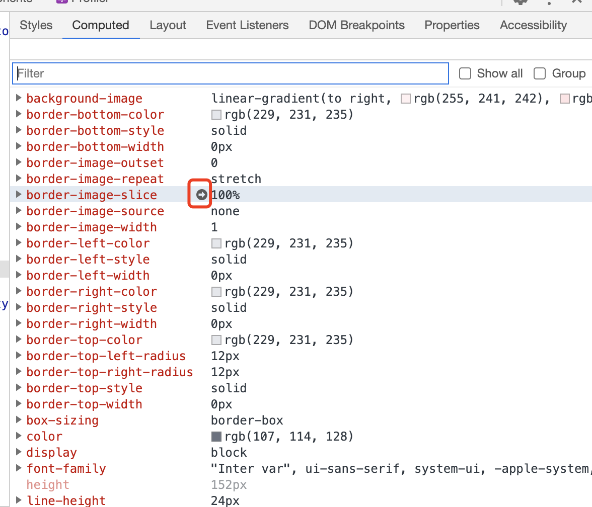
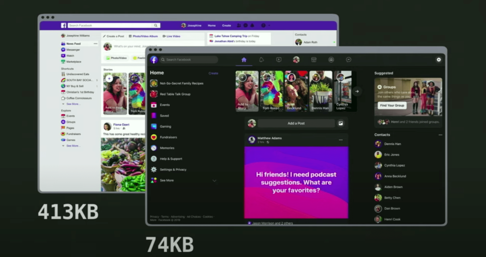

# 谈一谈对 TailwindCSS 的看法

TailwindCSS 因为一个 class 代表一个 CSS 属性这种原子化 CSS (Atomic CSS)，备受争议

## 四种粒度

``` html
<div style="{ borderRadius: '0.5rem', padding: '1rem' }"> Click </div>
```

``` html
<div class="rounded-lg p-4"> Click </div>
```

``` html
<div class="button"> Click </div>
```

``` jsx
<Button> Click </Button>
```

越往下，颗粒度越来越大，约束性变高，自由性不足。

## 一些问题

更好用的原子化的CSS

## Q: 这和行内 CSS 有何区别，不就少写几个字吗？

大部分人的想法应该是这样的: 仅仅对于 `text-center` 而言，虽然提供了些许方便，但是不足以拉开差距。

如果说它仅仅是简单的原子化 CSS，确实一般。

### 1. 方便性: `text-center`、`grid-cols-3`

或许一个 `text-center` 不足以使你觉得提供了多大的方便性，但对于一个三等分的 Grid 属性来说，一个 `grid-cols-3` 绝对方便

``` css
.grid-cols-3	{
  grid-template-columns: repeat(3, minmax(0, 1fr));
}
```

``` css
.shadow {

}
```

### 2. 语义化: `text-lg`、`rounded`、`text-white`

`text-lg`，一个较大字体，如果设置行内样式，肯定有诸多麻烦的事，我想设计一个较大的字体，那我应该设计多大尺寸、使用什么单位

### 3. 约束性: `bg-white`、`bg-white-500`、`text-lg`

新人总容易弄出一种大红大绿的新人风格网页，有了一些约束就很容易出现很糟糕的色彩控制

另外，有了 `text-lg` 此类，一个页面上就不会出现几十种参差不同的字体大小

### 4. 响应式: 

先来看一个在工作中会遇到的响应式布局问题:

> [响应式布局，一大堆子元素，在大屏幕三等分，中等屏幕二等分，小屏幕一等分？](https://q.shanyue.tech/fe/css/473.html)

``` html
<div class="container">
  <div class="item"></div>
  <div class="item"></div>
  <div class="item"></div>
  <div class="item"></div>
  <div class="item"></div>
  <div class="item"></div>
</div>
```

``` css
@media (min-width: 1024px) {
  .container {
    grid-template-columns: repeat(3,minmax(0,1fr));
  }
}

@media (min-width: 768px) {
  .container {
    grid-template-columns: repeat(2,minmax(0,1fr));
  }
}

.conainer {
  display: grid;
  grid-gap: 1rem;
  gap: 1rem;
}
```

``` html
<div class="grid grid-cols-1 md:grid-cols-2 lg:grid-cols-3 gap-4"></div>
```

### 5. 修饰符

.parrent:hover .child 

height: calc(100vh - 6rem)

## Q: 造成新的记忆负担

这个问题就仁者见仁智者见智了，在 Vue 的 `template` 语法中也经常出现此类问题，很多人会对一些命名上的约定，特别是自己不太喜欢的约定天然排斥，这也无可厚非。

我在初期确实会一边开发网页，一边瞅着文档全局搜索: [TailwindCSS 属性查找](https://tailwindcss.com/docs/border-radius)，现在借助浏览器插件及熟能生巧的经验已经不太需要翻文档了

1. [Tailwind CSS IntelliSense](https://marketplace.visualstudio.com/items?itemName=bradlc.vscode-tailwindcss)

初期经常花时间翻文档而不手写 CSS，而其中的原因不外乎两个:

1. 多写几个字母，确实有点嫌麻烦，有这时间还不如看看文档，全局搜索下也不费事
1. 自己设置一个 fontSize，padding、margin 实在不知道设置多少尺寸，tailwindcss 有较大的约束

过了多久觉得: 嗯，真香

## Q: 仅仅是实现一个原子化的 CSS，怎么这么多 Star？

因为他确实比较方便！

使用 Gihub Star 数和 npm 周下载量来表明一个库的受欢迎程度

1. [mime](https://github.com/broofa/mime): 获取 Mime Type。几十行代码，每周 3700 万次下载，1.6K Star
1. [classnames](https://github.com/JedWatson/classnames): 根据条件连接 class 类名。一百几十行代码，每周 580 万次下载，13.5K Star
1. [js-cookie](https://github.com/js-cookie/js-cookie): 操作 cookie。一百多行代码，每周 200 万次下载，17K Star
1. [ms](https://github.com/vercel/ms): `ms('2 days')` 可读性的时间转化为秒数。几十行代码，每周 7300 万次下载，3.3K Star
1. [isMobile](https://github.com/kaimallea/isMobile): 检测当前 web 环境是否为移动端。几十行代码，每周 15 万下载，2K Star
1. [unfetch]

## Q: 初期很爽，但是后期维护困难，特别是人员调动后

我算是 TailwindCSS 中度使用者吧，目前还没有后期维护困难方面的困惑。至于人员调动，由于我已经半年没有在公司敲代码，也不曾遇到这种情况。

至于调试，可轻松使用 `chrome devtools`，还是可以一眼望到底的，而且**没有以前各种 class 存在属性重复覆盖，造成调试困难，从下图可看出 tailwindcss 调试一目了然**



即使实在有过多的 CSS Class，也可以**通过 `Computed` 面板中的小箭头跳转过去找到相对应的 class**



## Q: 虽然 CSS 体积大幅降低，但是 HTML 体积却变大了

Facebook 经过重构后 CSS 体积已经从 413Kb 减至 74Kb。



gzip 的核心是 Deflate，而它使用了 LZ77 算法与 Huffman 编码来压缩文件，重复度越高的文件可压缩的空间就越大。

即使 HTML 因为类名过多造成体积增大，由于 class 高度相似，gzip 也将会得到一个很大的压缩比例。


background-image
CSS function 有可能没办法用的很好


.border-1 .border

https://github.com/tailwindlabs/tailwindcss/issues/2978

https://www.npmjs.com/package/byte-size

SVG 中 classname 没有被抽取出来
